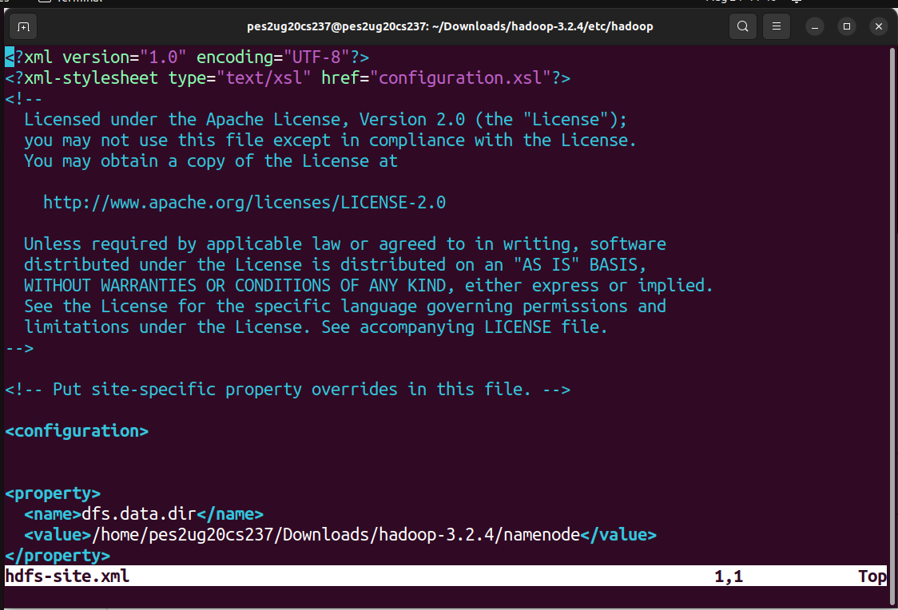
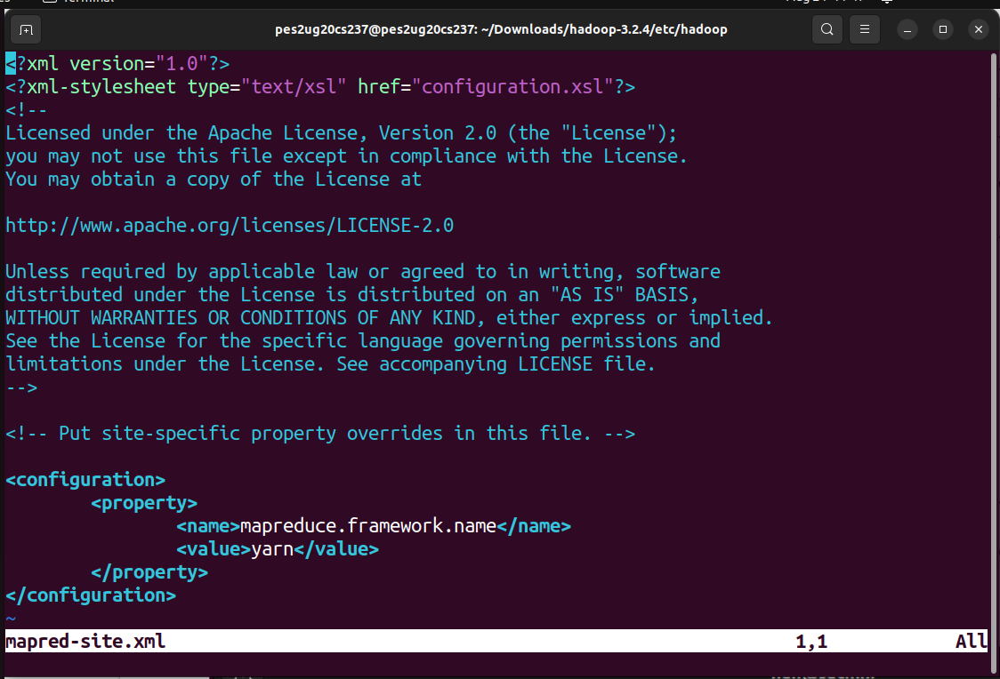

# Hadoop Installation Guide and HDFS Hands On - H1 (Homework)

Every step is to be executed on the home directory. Use `cd` to move to home directory.

The commands in the guide use ```USER``` as the notation for your username. If you have executed A0 correctly, then this should be your SRN in lowercase. This is important since the auto-evaluation depends on it. Verify your username by running `whoami` on the terminal.

Change any `/home/USER/` to `/home/<your SRN>/`

### This manual includes steps that you will be doing from your home.

**The part which will be done in class will be shared later**

Execute the following commands to move to the home directory and updating the package list and the system. This guide assumes that you are working with Ubuntu or a Debian based distribution.
```bash
cd
sudo apt update -y
sudo apt upgrade -y
```

## Downloads
### Step 1 - Installing Java

Since Hadoop 3.3.3 may not support newer versions of Java, we install Java 8 using the following command.
```bash
sudo apt install openjdk-8-jdk -y
```

Check if Java is successfully installed and the version with the following commands.
```bash
java -version
javac -version
```

### Step 2 - Downloading Hadoop

Use the link given below to download and extract hadoop using the following commands.
```bash
cd
wget https://dlcdn.apache.org/hadoop/common/hadoop-3.3.3/hadoop-3.3.3.tar.gz
tar xzf /home/USER/hadoop-3.3.3.tar.gz
```

## Installation

### Step 1 - Setup passwordless SSH for Hadoop

We install the following packages to allow us to setup an ssh server on the system as well as a client to remote into it with the following commands.
```bash
sudo apt install openssh-server openssh-client -y
```

#### Enable passwordless SSH

Generate an SSH key pair and define the location is is to be stored in id_rsa. Then use the cat command to store the public key as authorized_keys in the ssh directory. Follow these exact commands with change in permissions.
```bash
ssh-keygen -t rsa -P '' -f ~/.ssh/id_rsa
cat ~/.ssh/id_rsa.pub >> ~/.ssh/authorized_keys
chmod 0600 ~/.ssh/authorized_keys
```

Verify passwordless SSH is setup and working with
```bash
ssh localhost
```

If the above command does not ask you for a password, you have successfully setup passwordless SSH. Take a screenshot of the terminal and name is 1a.png.


Type `exit` or press ```Ctrl+d``` to quit the SSH session.


### Step 2 - Single Node Deployment

The current setup is called pseudo-distributed mode, allows each Hadoop daemon to run as a single Java process. A Hadoop environment is configured by editing the following list of configuration files:

* .bashrc
* hadoop-env.sh
* core-site.xml
* hdfs-site.xml
* mapred-site-xml
* yarn-site.xml

Before editing the above mentioned files, we need to make a few directories for our namenodes and datanodes along with the required permissions.

```bash
cd
mkdir dfsdata
mkdir tmpdata
mkdir dfsdata/datanode
mkdir dfsdata/namenode
```
Change permissions for the directories using the following commands. Remember to replace `USER` with your username.

```bash
sudo chown -R USER:USER /home/USER/dfsdata/
sudo chown -R USER:USER /home/USER/dfsdata/datanode/
sudo chown -R USER:USER /home/USER/dfsdata/namenode/
```

#### Editing and Setting up the ~/.bashrc config file
Open .bashrc with any text editor of your choice. This guide recommends using ```nano```.
```bash
sudo nano ~/.bashrc
```

Scroll to the bottom of the file. Copy and paste the below mentioned statements to the end of the file.
```bash
#Hadoop Path Configs
export HADOOP_HOME=/home/USER/hadoop-3.3.3
export HADOOP_INSTALL=$HADOOP_HOME
export HADOOP_MAPRED_HOME=$HADOOP_HOME
export HADOOP_COMMON_HOME=$HADOOP_HOME
export HADOOP_HDFS_HOME=$HADOOP_HOME
export YARN_HOME=$HADOOP_HOME
export HADOOP_COMMON_LIB_NATIVE_DIR=$HADOOP_HOME/lib/native
export PATH=$PATH:$HADOOP_HOME/sbin:$HADOOP_HOME/bin
export HADOOP_OPTS="Djava.library.path=$HADOOP_HOME/lib/native"
```

Take a screenshot at this stage and name it 2a.png. Make sure the filename on the top with the path is visible in the screenshot.


Press ```Ctrl+o``` to save and ```Ctrl+x``` to exit nano . Apply changes to ```bash``` with the following command.
```bash
source ~/.bashrc
```
You can verify if the changes have been made by using the ```echo``` command and checking if the corresponding path gets printed in the terminal.

```bash
echo $HADOOP_HOME
echo $PATH
```

#### Setup hadoop-env.sh 

Open the file with
```bash
sudo nano $HADOOP_HOME/etc/hadoop/hadoop-env.sh
```
Scroll down until you find the commented line `# export JAVA_HOME=`. Uncomment the line and replace the path with your Java path. The final line should look like this
```bash
export JAVA_HOME=/usr/lib/jvm/java-8-openjdk-amd64
```

Take a screenshot at this stage and name it 2b.png. Make sure the filename on the top with the path is visible in the screenshot.


Save and exit the file as shown previously.

#### Setup core-site.xml

Open the file with
```bash
sudo nano $HADOOP_HOME/etc/hadoop/core-site.xml
```
Replace the existing configuration tags with the following
```bash
<configuration>
<property>
  <name>hadoop.tmp.dir</name>
  <value>/home/USER/tmpdata</value>
</property>
<property>
  <name>fs.default.name</name>
  <value>hdfs://127.0.0.1:9000</value>
</property>
</configuration>
```

Take a screenshot of the file and name it 2c.png. Make sure the filename on the top with the path is visible in the screenshot.


Save and exit the file. 

#### Setup hdfs-site.xml

Open the file using 
```bash
sudo nano $HADOOP_HOME/etc/hadoop/hdfs-site.xml
```
Replace the existing configuration tags with the following

```bash
<configuration>
<property>
  <name>dfs.name.dir</name>
  <value>/home/USER/dfsdata/namenode</value>
</property>
<property>
  <name>dfs.data.dir</name>
  <value>/home/USER/dfsdata/datanode</value>
</property>
<property>
  <name>dfs.replication</name>
  <value>1</value>
</property>
</configuration>
```

Take a screenshot of the file and name it 2d.png. Make sure the filename on the top with the path is visible in the screenshot.



Save and exit the file after making all the changes.

#### Setup mapred-site.xml

Open the file with
```bash
sudo nano $HADOOP_HOME/etc/hadoop/mapred-site.xml
```
Replace the existing configuration tags with the following
```bash
<configuration> 
<property> 
  <name>mapreduce.framework.name</name> 
  <value>yarn</value> 
</property> 
</configuration>
```

Take a screenshot of the file and name it 2e.png. Make sure the filename on the top with the path is visible in the screenshot.



Save and exit the file.

#### Setup yarn-site.xml

Open the file with
```bash
sudo nano $HADOOP_HOME/etc/hadoop/yarn-site.xml
```
Replace the existing configuration tags with the following
```bash
<configuration>
<property>
  <name>yarn.nodemanager.aux-services</name>
  <value>mapreduce_shuffle</value>
</property>
<property>
  <name>yarn.nodemanager.aux-services.mapreduce.shuffle.class</name>
  <value>org.apache.hadoop.mapred.ShuffleHandler</value>
</property>
<property>
  <name>yarn.resourcemanager.hostname</name>
  <value>127.0.0.1</value>
</property>
<property>
  <name>yarn.acl.enable</name>
  <value>0</value>
</property>
<property>
  <name>yarn.nodemanager.env-whitelist</name>   
  <value>JAVA_HOME,HADOOP_COMMON_HOME,HADOOP_HDFS_HOME,HADOOP_CONF_DIR,CLASSPATH_PERPEND_DISTCACHE,HADOOP_YARN_HOME,HADOOP_MAPRED_HOME</value>
</property>
</configuration>
```

Take a screenshot of the file and name it 2f.png. Make sure the filename on the top with the path is visible in the screenshot.


Save and exit the file.

## The next steps will be done in class. Keep the screenshots.