> Note : these steps are for after having installed hive with a schema metadata manager like derby of nosql

## Details : 
- Name : P K Navin Shrinivas
- SRN : PES2UG20CS237
- SECTION : D

## Steps : 
- First up we need to create the schema : 
```
create table netflix(
    show_id String,
    type String,
    title String,
    director String,
    country String,
    release_year int,
    primary key (show_id) disable novalidate
        );
```
- Next up download the csv file like so : 
```
wget https://raw.githubusercontent.com/Cloud-Computing-Big-Data/UE20CS322-H2/main/netflix1.csv
```
- Lets load it into hive! (Make sure to use absolute paths in linux)
```
load data local inpath '/home/pes2ug20cs237/github/UE20CS30X-Submissions/BDLAB/SUBMISSION3/netflix1.csv' into table netflix;
```
> Note : replace the path of file with what fits your system
- Lets see if the data is loaded using : 
```
select * from netflix limit 3;
```
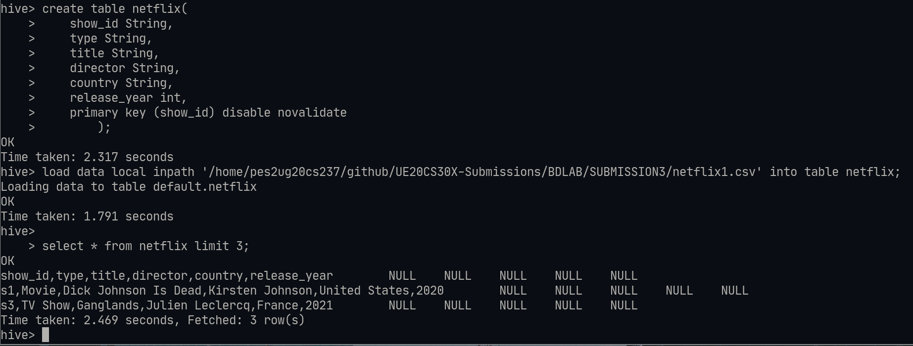
> Note : For jobs like SELECT, FILTER, LIMIT....Hive does not run map red job, instead uses FETCH of HDFS!

- By default all data warehouse data from hive are stored in /user/hive/warehouse, we can check this by doing the following hdfs commands : 
```
hdfs dfs -ls /user/hive/warehouse
```
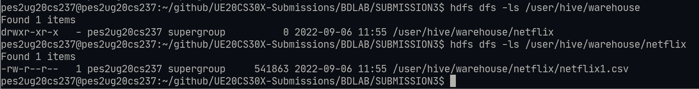
> Note :  this shows us the fact that a new folder is created for every schema we have!

- Partitioning data : 
Hive organizes tables into partitions. It is a way of dividing a table into related parts based on the values of partitioned columns such as type,country etc. Using partition, it is easy to query a portion of the data. For example, a table named Employee contains employee data such as id, name, dept, and yoj (i.e., year of joining). Suppose you need to retrieve the details of all employees who joined in 2012. A query searches the whole table for the required information. However, if you partition the employee data with the year and store it in a separate file, it reduces the query processing time.
```
hive >set hive.exec.dynamic.partition=True;
hive > set hive.exec.dynamic.partition.mode=nonstrict;
hive > create table netflix_partition(
    title String,
    director String,
    country String,
    release_year int
        ) partitioned by (type String);

hive > insert into table netflix_partition partition(type="Movie") select title,director,country,release_year from netflix where type="Movie";
hive > insert into table netflix_partition partition(type="TV Show") select title,director,country,release_year from netflix where type="TV Show";
hive > select * from netflix_partition limit 3;
```
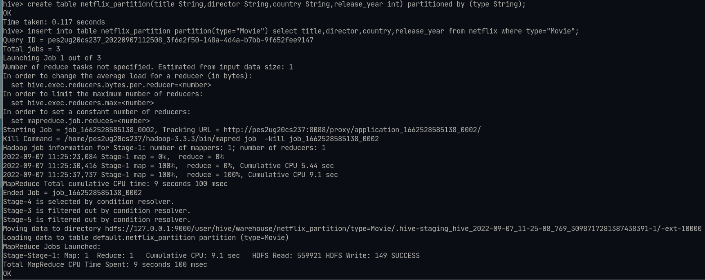
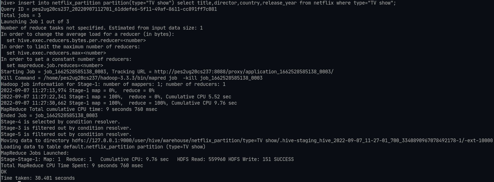
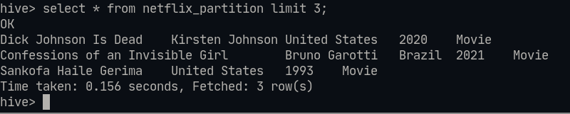

We can also see these partitions in the dfs : 

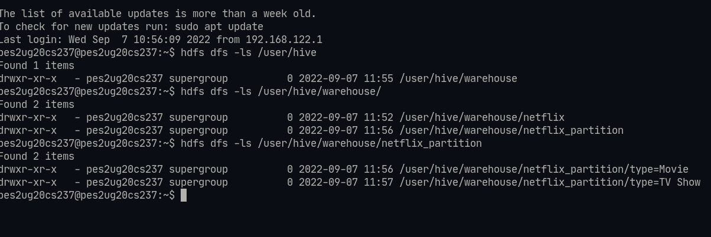

- Bucketing : 
Tables or partitions are sub-divided into buckets, to provide extra structure to the data that may be used for more efficient querying. Bucketing works based on the value of hash function of some column of a table.
```
hive > set hive.enforce.bucketing=True;
hive > create table netflix_bucket(
    title String,
    director String,
    country String,
    release_year int
        ) partitioned by (type String) CLUSTERED by (country) into 10 buckets;
```
> Note : into 10 buckets indicative that the hash function is %10 
```
hive > insert into table netflix_bucket partition(type="Movie") select title,director,country,release_year from netflix where type="Movie";
```

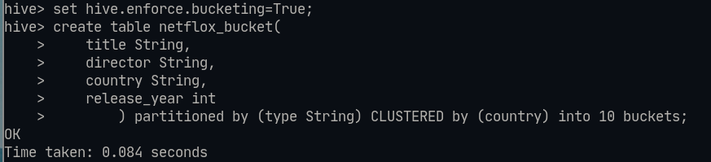
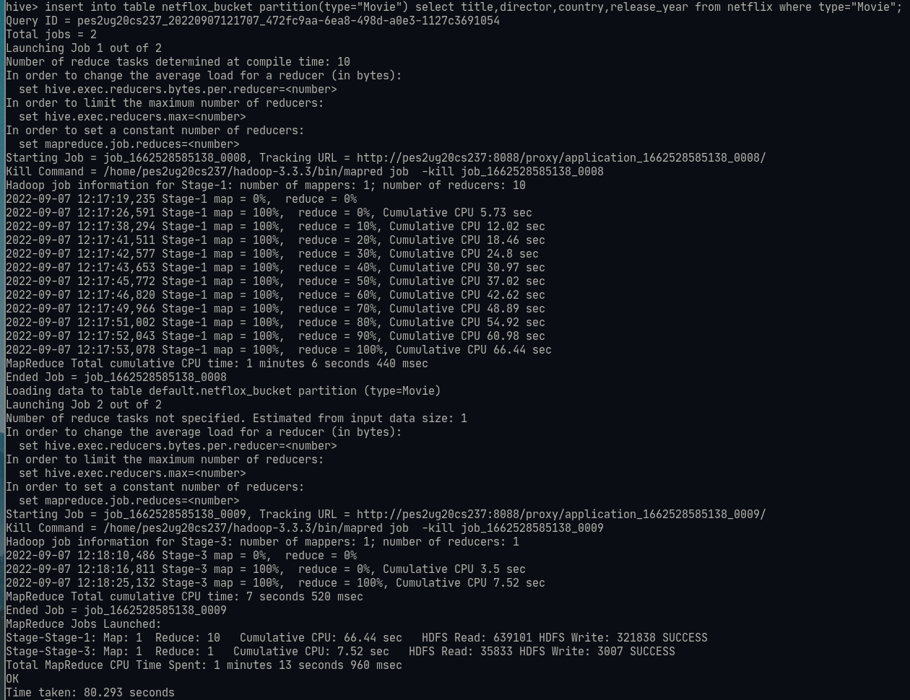

We can see these buckets with partitions in the dfs too : 

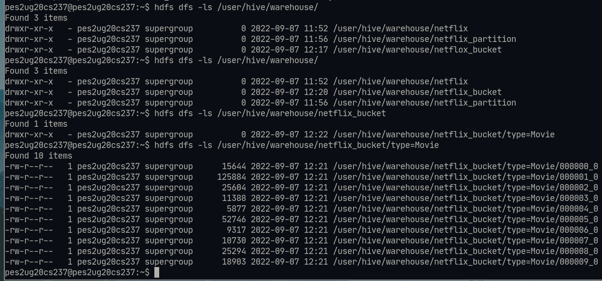


- Map joins and normal joins : 
First up, create two table and load the data.
```
hive > create table customers(customer_id int,initals String,street String,country String);
hive > create table orders(customer_id int,order_id String,order_date date,total_cost int);
hive > insert into customers values
(1,"GH","123 road","UK"),
(3,"JK","456 road","SP"),
(2,"NL","789 road","BZ"),
(4,"AJ","1011 road","AU"),
(5,"PK","1213 road","IN");
hive > insert into orders values
(1,1,"2022-01-04",100),
(3,4,"2022-03-07",20),
(2,2,"2022-01-02",60),
(2,3,"2022-02-01",150);
```
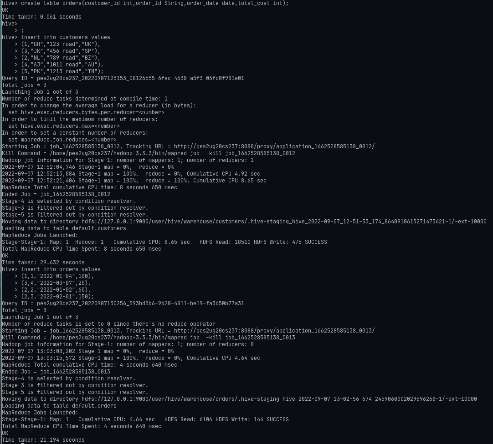

Doing a normal join on these two tables : 
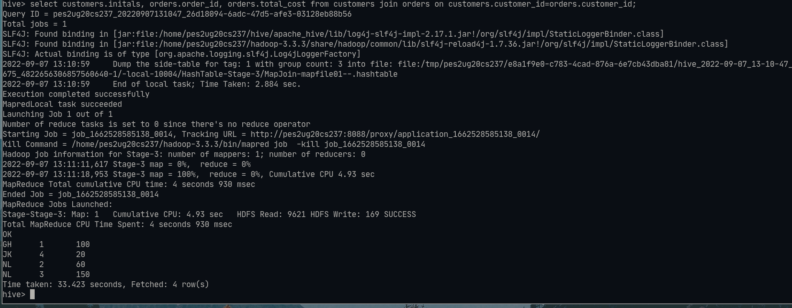

What is map join : A table can be loaded into the memory completely within a mapper without using the Map/Reducer process. It reads the data from the smaller table and stores it in an in-memory hash table and then serializes it to a hash memory file, thus substantially reducing the time. It is also known as Map Side Join in Hive. Basically, it involves performing joins between 2 tables by using only the Map phase and skipping the Reduce phase. A time decrease in your queries’ computation can be observed if they regularly use a small table joins. Map-side join helps in minimizing the cost that is incurred for sorting and merging in the shuffle and reduce stages. Map-side join also helps in improving the performance of the task by decreasing the time to finish the task.
```
SELECT /*+ MAPJOIN(orders) */ customers.initals,orders.order_id,orders.total_cost from customers join orders on customers.customer_id=orders.customer_id;
```
> Note : in the above MAPJOIN(orders) loads orders into memory and stores it in a hash map.
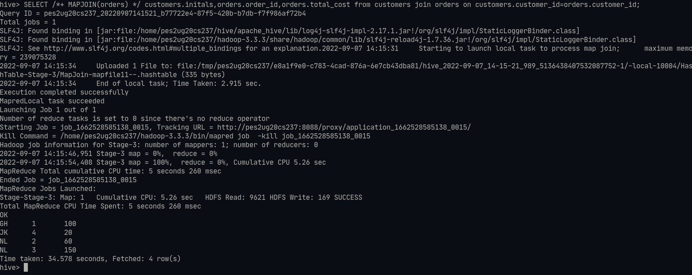

- Transacitions : Update, Delete and Modify
These are transactional commansd and hence need particular configs in hive : 
```
SET hive.support.concurrency=true;
SET hive.txn.manager=org.apache.hadoop.hive.ql.lockmgr.DbTxnManager;
SET hive.compactor.initiator.on=true;
SET hive.compactor.worker.threads=1;
```

Let's now create a new table with transactional properties : 
```
create table transaction_table(
    name String
        ) STORED AS ORC TBLPROPERTIES ('transactional' = 'true');
```
    - ORC : The Optimized Row Columnar (ORC) file format provides a highly efficient way to store Hive data. It was designed to overcome limitations of the other Hive file formats. Using ORC files improves performance when Hive is reading, writing, and processing data. Let's now insert data into this table : 
```
 insert into transaction_table VALUES
    ("navin1"),
    ("navin2"),
    ("navin3");
```
    - Updating
```
UPDATE transaction_table 
SET name="not_navin" 
WHERE name="navin3";
```
> WHERE clause is optional, if not present it updates all the records.
    - Deleting records : 
```
DELETE FROM transaction_table
WHERE name="not_navin";
```
> WHERE clause is optional, if not present it deletes all the recods.

## Excersise : 
- creating table : 
```
CREATE TABLE costs(
    id int,
    item_name String,
    item_cost double,
    primary key (id) disable novalidate
        ) STORED AS ORC TBLPROPERTIES('transactional' = 'true');
```
- Inserting records : 
```
INSERT INTO costs VALUES
(1,"chocolate",100),
(2,"grape", 50),
(3,"chips", 10),
(4,"oranges", 80),
(5,"apples", 90),
(6,"chips", 20),
(7,"chocolate", 90),
(8,"grape", 100),
(9,"chips", 40),
(10,"oranges", 70),
(11,"apples", 90),
(12,"chips", 20);
```
- Updating the cost of chips to 30 : 
```
UPDATE costs
SET item_cost=30
WHERE item_name="chips";
```
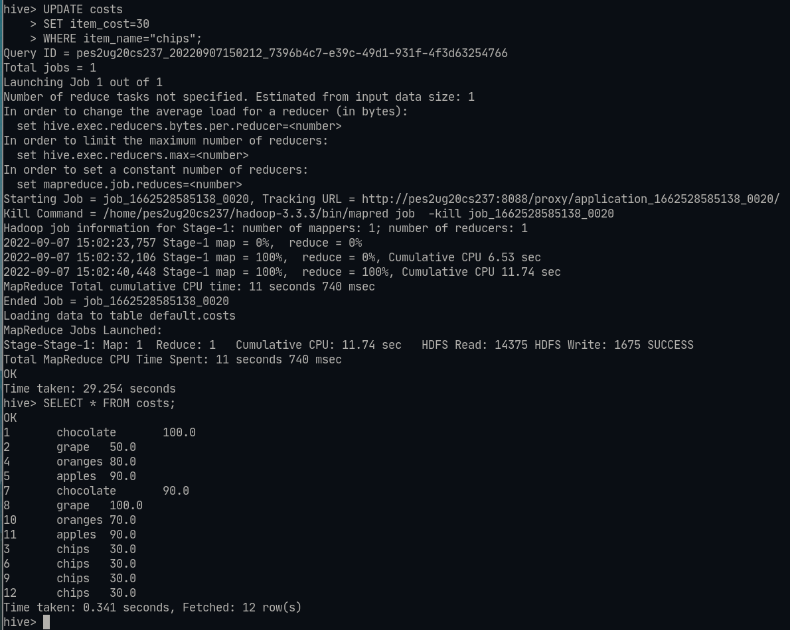

- Deleting records with max item_cost : 
```
DELETE FROM costs
WHERE item_cost IN (SELECT max(item_cost) from costs);
```
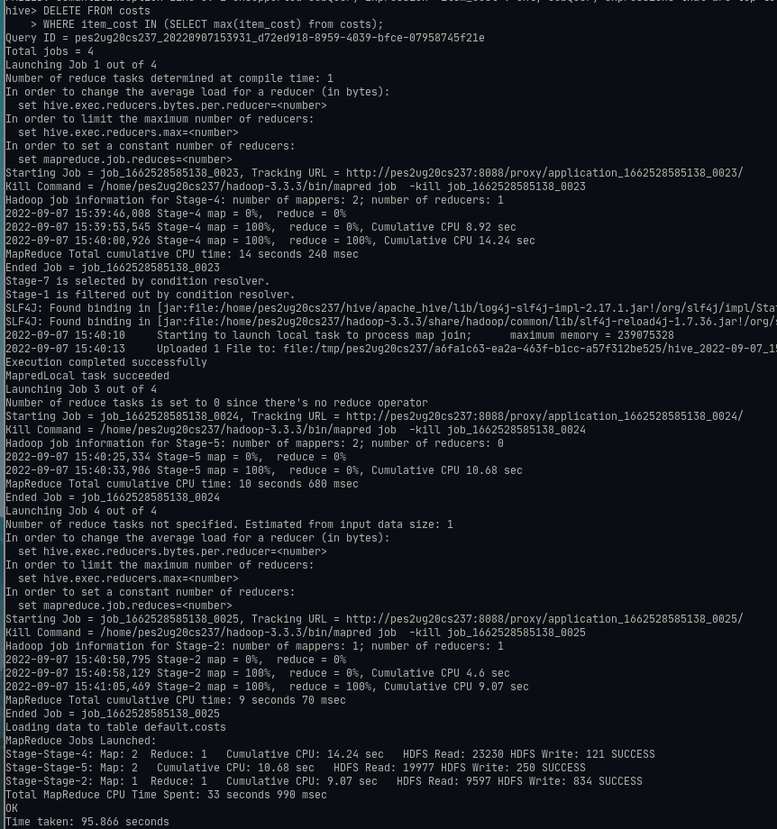
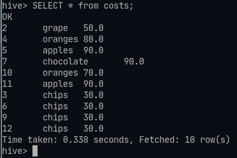

- Query to find total number of each item 
```
SELECT item_name, COUNT(*) FROM costs GROUP BY item_name;
```
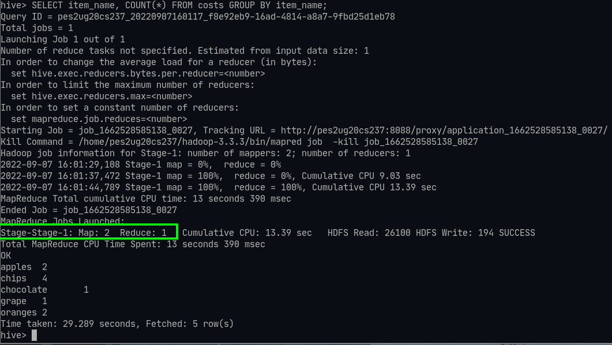
