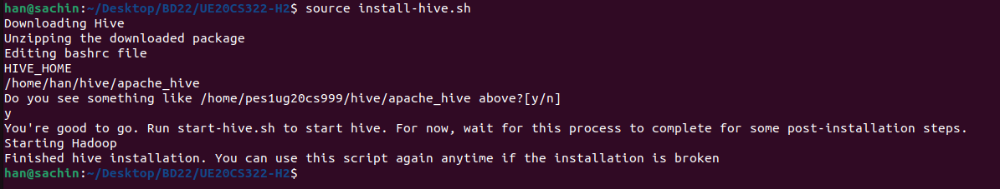

# Hive Installation Guide and HQL Hands On - H2

Clone the remote repository to your local machine by running the command below.

```bash
git clone https://github.com/Cloud-Computing-Big-Data/UE20CS322-H2.git
```

**ALL COMMANDS MUST BE RUN ONLY AFTER CLONING THE REPO AND FROM WITHIN THE LOCALLY CLONED FOLDER ONLY**

## Step 1 - Install Hive by executing the shell script provided

First provide both the shell scripts the necessary permissions

```bash
chmod +x *.sh 
```

To install hive run the following command:

```bash
source install-hive.sh
```

Please do not run `./install-hive.sh` or `bash install-hive.sh` or any other variations apart from `source` as it will not work.

Take a screenshot of the terminal output and save it as `1a.png`.

Start hive shell using the following command:

```bash
start-hive.sh
```

It is necessary to run the above command everytime you want to start hive shell.

## Make sure your hive installation is successful before the class session.
**Please do not refer to the repository for the next steps since it is stil incomplete and buggy.**