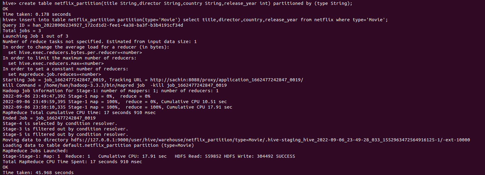
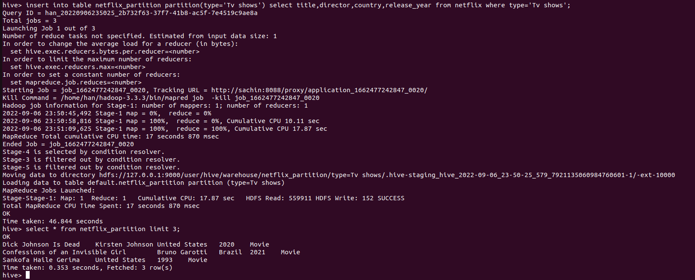
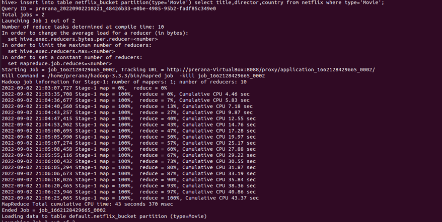
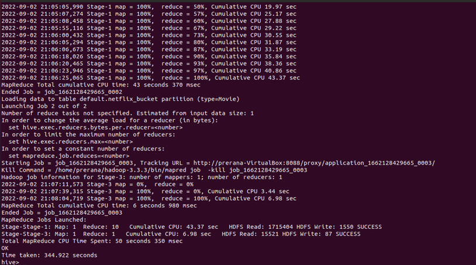
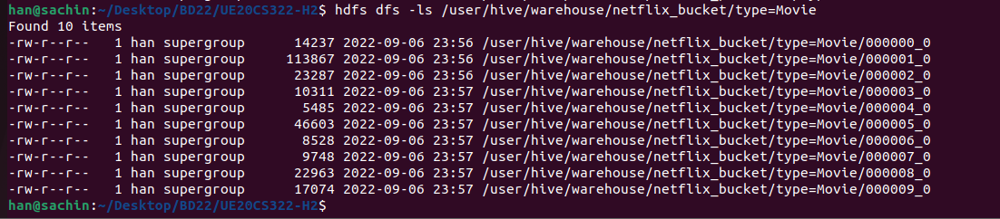
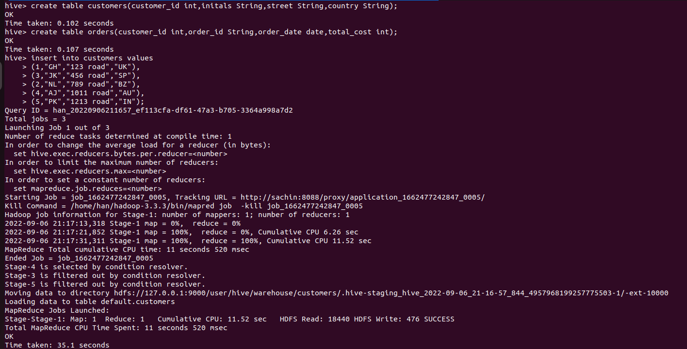
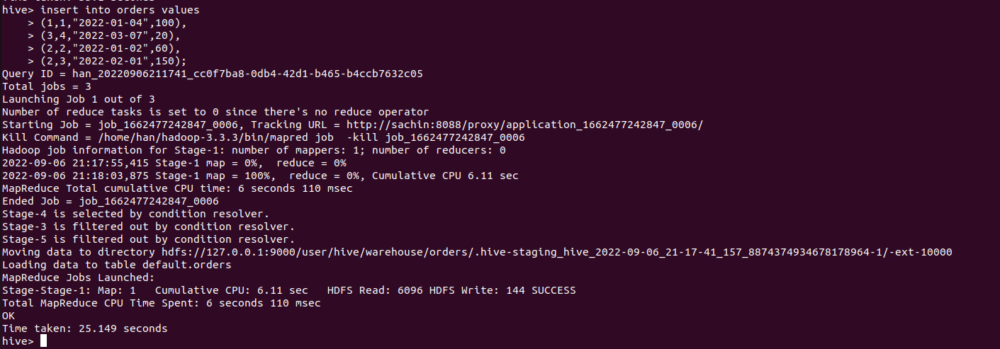
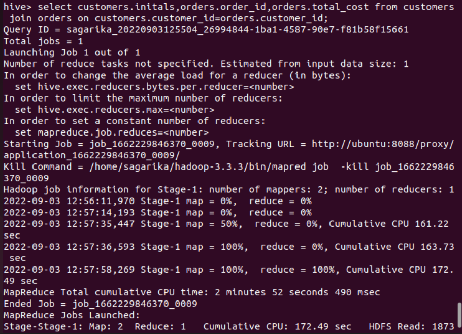
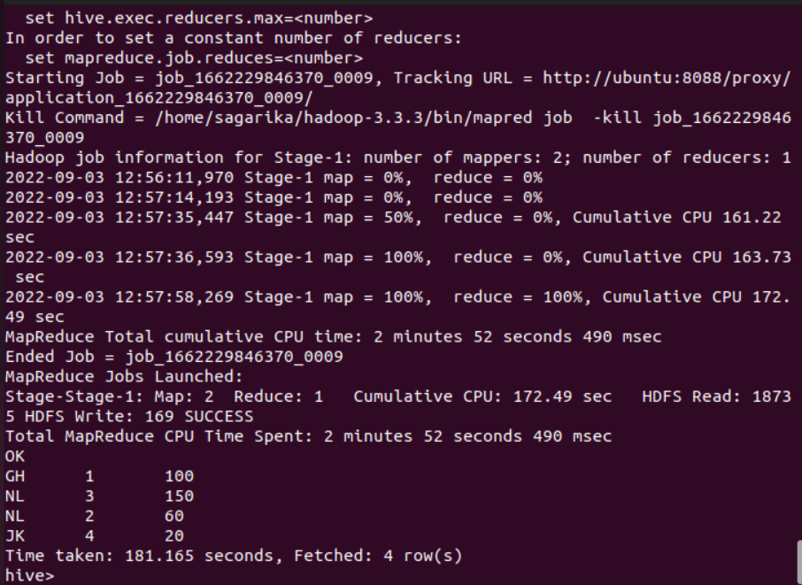

# Hive Installation Guide and HQL Hands On - H2

This guide is the CLASS component for the Hive Installation and HQL Hands On. Before you start, please make sure you have completed the HOME part found [here](https://github.com/Cloud-Computing-Big-Data/UE20CS322-H2/blob/main/INSTALL_HIVE.md). Follow the instructions in this file to complete the hands-on/tutorial tasks.

**ALL COMMANDS MUST BE RUN ONLY AFTER CLONING THE REPO AND FROM WITHIN THE LOCALLY CLONED FOLDER ONLY**

## Few useful commands

### To start the Hive CLI

```bash
start-hive.sh
```

### If you are running into issues with starting Hadoop, try the following

```bash
stop-all.sh
sudo rm -rf ~/dfsdata/
sudo rm -rf ~/tmpdata/
hdfs namenode -format
start-all.sh
```

### To remove all data from HDFS which is involved with Hive

```bash
hdfs dfs -rm -r -f /user*
```

**(Screenshot numbers begin from 2 since screenshot 1a was from the HOME component)**

## TASK 1 - Create tables, partitions and buckets in hive.


Find the dataset "netflix1.csv" provided in the repo <a href="https://github.com/Cloud-Computing-Big-Data/UE20CS322-H2/blob/main/netflix1.csv" target="_blank">here</a>. You would find this dataset in the cloned repo as well.

<b></b>

| attribute     | Description                  | DataType  |
| ------------- |:-------------:               | -----:    |
| show_id       | unique values                | String    |
| type          | Content(Tv show or Movie)    | String    |
| title         | Title                        | String    |
| director      | Director of the show or movie| String    |
| country       | Country of the show or movie | String    |
| release_year  | Content release year         | int       |

### TABLE

Create a table with the above schema in the Hive shell.

```bash
create table netflix(show_id String,type String,title String,director String,country String,release_year int,primary key (show_id) disable novalidate) row format delimited fields terminated by ',';
```

Now load the CSV file into the netflix table created in the Hive shell.

```bash
load data local inpath 'PATH_TO_netflix1.csv' into table netflix;
```

**Make sure you replace the PATH_TO_netflix1.csv with the actual path to the file**

Since the dataset is huge lets query the first 3 records in the database.
When you perform "select * from tablename", Hive fetches the whole data from file as a FetchTask rather than a mapreduce task which just dumps the data as it is without doing anything on it. This is similar to "hadoop dfs -text <filename>".Therefore when queried using SELECT, FILTER, LIMIT, this property skips mapreduce and uses FETCH task. As a result Hive can execute query without running mapreduce task as shown below.

```bash
select * from netflix limit 3;
```
**Take a screenshot of the terminal output and name it 2a.png**(If you have multiple screenshots because all content did not fit in one, you can name them 2a1.png, 2a2.png, 2a3.png, etc.)


Hive is a data warehouse database for Hadoop, all database and table data files are stored at HDFS location /user/hive/warehouse by default.

To check all database and table files stored open a new terminal and use the following command

```bash
hdfs dfs -ls /user/hive/warehouse
hdfs dfs -ls /user/hive/warehouse/netflix
```

**Take a screenshot of the terminal output and name it 2b.png**


### PARTITION

Hive organizes tables into partitions. It is a way of dividing a table into related parts based on the values of partitioned columns such as type,country etc. Using partition, it is easy to query a portion of the data.
For example, a table named Employee contains employee data such as id, name, dept, and yoj (i.e., year of joining). Suppose you need to retrieve the details of all employees who joined in 2012. A query searches the whole table for the required information. However, if you partition the employee data with the year and store it in a separate file, it reduces the query processing time. 

Firstly enable dynamic partition using the commands in the Hive shell as follows:

```bash
set hive.exec.dynamic.partition=True;
set hive.exec.dynamic.partition.mode=nonstrict;
```

To create a partitioned table we have to follow the below command in the Hive shell:

```bash
create table netflix_partition(title String,director String,country String,release_year int) partitioned by (type String);
```
Now we will load the data into the partitioned table using the following command in the Hive shell:

```bash
insert into table netflix_partition partition(type='Movie') select title,director,country,release_year from netflix where type='Movie';
insert into table netflix_partition partition(type='TV Show') select title,director,country,release_year from netflix where type='TV Show';
```
Let's check the partitioned table

```bash
select * from netflix_partition limit 3;
```

**Take a screenshot of the terminal output and name it 2c.png**(If you have multiple screenshots because all content did not fit in one, you can name them 2c1.png, 2c2.png, 2c3.png, etc.)





To check the partitions stored in Hadoop data warehouse, use the following command on the terminal:

```bash
hdfs dfs -ls /user/hive/warehouse/netflix_partition/type=Movie
hdfs dfs -ls /user/hive/warehouse/netflix_partition/type=TV\ Show
```

**Take a screenshot of the terminal output and name it 2d.png**


### BUCKETS

Tables or partitions are sub-divided into buckets, to provide extra structure to the data that may be used for more efficient querying. Bucketing works based on the value of hash function of some column of a table.

The command below allows the correct number of reducers and the cluster by column to be automatically selected based on the table in the Hive shell:

```bash
set hive.enforce.bucketing=True;
```

Create bucketing on country column on top of partitioning by type and insert data in the Hive shell:

```bash
CREATE TABLE netflix_bucket(title String,director String,country String) PARTITIONED BY(type String) CLUSTERED BY (country) INTO 10 BUCKETS;
insert into table netflix_bucket partition(type='Movie') select title,director,country from netflix where type='Movie';
```

**Take a screenshot of the terminal output and name it 2e.png**(If you have multiple screenshots, you can name them 2e1.png, 2e2.png, 2e3.png, etc.)






To check the buckets stored in hadoop data warehouse, use the following command on the terminal:

```bash
hdfs dfs -ls /user/hive/warehouse/netflix_bucket/type=Movie
```

**Take a screenshot of the terminal output and name it 2f.png**



## TASK 2- HQL Map Join and Normal Join

### Problem statement : 
Given two datasets, customers and orders, perform MapJoin and normal Join operations in Hive.


### CUSTOMERS 

| attribute     | Description                  | DataType  |
| ------------- |:-------------:               | -----:    |
| customer_id   | Customer ID                  | String    |
| initals       | Customer Initials            | String    |
| street        | Street                       | String    |
| country       | Country                      | String    |

### ORDERS

| attribute     | Description                  | DataType  |
| ------------- |:-------------:               | -----:    |
| customer_id   | Customer ID                  | String    |
| order_id      | Order ID                     | String    |
| order_date    | order date                   | String    |
| total_cost    | Total Cost                   | int       |


Similar to Task 1, create tables and load data into the created tables.

```bash
create table customers(customer_id int,initals String,street String,country String);
create table orders(customer_id int,order_id String,order_date date,total_cost int);
```


```bash
insert into customers values
(1,"GH","123 road","UK"),
(3,"JK","456 road","SP"),
(2,"NL","789 road","BZ"),
(4,"AJ","1011 road","AU"),
(5,"PK","1213 road","IN");
insert into orders values
(1,1,"2022-01-04",100),
(3,4,"2022-03-07",20),
(2,2,"2022-01-02",60),
(2,3,"2022-02-01",150);
```

**Take a screenshot of the terminal output and name it 3a.png**(If you have multiple screenshots, you can name them 3a1.png, 3a2.png, 3a3.png, etc.)




Let us first understand the functionality of normal join,

Whenever, we apply join operation, the job will be assigned to a Map Reduce task which consists of two stages- a ‘Map stage’ and a ‘Reduce stage’. A mapper’s job during Map Stage is to “read” the data from join tables and to “return” the ‘join key’ and ‘join value’ pair into an intermediate file. Further, in the shuffle stage, this intermediate file is then sorted and merged. The reducer’s job during reduce stage is to take this sorted result as input and complete the task of join.


```bash
select customers.initals,orders.order_id,orders.total_cost from customers join orders on customers.customer_id=orders.customer_id;
```

As you can see in normal join all the tasks will be performed by both mapper and reducer. **Take a screenshot of the terminal output and name it 3b.png**(If you have multiple screenshots, you can name them 3b1.png, 3b2.png, 3b3.png, etc.)




A table can be loaded into the memory completely within a mapper without using the Map/Reducer process. It reads the data from the smaller table and stores it in an in-memory hash table and then serializes it to a hash memory file, thus substantially reducing the time. It is also known as Map Side Join in Hive. Basically, it involves performing joins between 2 tables by using only the Map phase and skipping the Reduce phase. A time decrease in your queries’ computation can be observed if they regularly use a small table joins. Map-side join helps in minimizing the cost that is incurred for sorting and merging in the shuffle and reduce stages. Map-side join also helps in improving the performance of the task by decreasing the time to finish the task.

Before running the query, we have to set the below property to true in the Hive shell:

```bash
set hive.auto.convert.join=true;
```

Query:
```bash
SELECT /*+ MAPJOIN(orders) */ customers.initals,orders.order_id,orders.total_cost from customers join orders on customers.customer_id=orders.customer_id;
```

**Take a screenshot of the terminal output and name it 3c.png.**


Verify the time taken for both Map Join and Normal Join.

## TASK 3 - Update ,delete entries in a Table and Query

Firstly you need to enable ACID Transactions to support transactional queries, one of the important property need to know is hive.txn.manager which is used to set Hive Transaction manager.

Below are the properties you need to enable ACID transactions.

```bash
SET hive.support.concurrency=true;
SET hive.txn.manager=org.apache.hadoop.hive.ql.lockmgr.DbTxnManager;
# The following parameters are required for standalone hive metastore
SET hive.compactor.initiator.on=true;
SET hive.compactor.worker.threads=1;
```

To support ACID transactions you need to create a table with TBLPROPERTIES (‘transactional’=’true’); and the store type of the table should be ORC.

```bash
CREATE TABLE table_name (
 col_name data_type)
 STORED AS ORC
 TBLPROPERTIES ('transactional'='true');
```

Insert Records into the table

```bash
INSERT INTO table_name VALUES(col_value);
```

Hive UPDATE SQL query is used to update the existing records in a table.When WHERE clause not used, Hive updates all records in a table.By using WHERE clause you can specify a condition which records to update.

Update statement Syntax:

```bash
UPDATE tablename 
SET column = value 
WHERE expression;
```
(The WHERE clause is optional. If you omit the WHERE clause, all records in the table will be updated.)


Hive DELETE SQL query is used to delete the records from a table.

Delete statement Syntax:

```bash
DELETE FROM tablename 
WHERE expression;
```

(The WHERE clause is optional. If you omit the WHERE clause, all records in the table will be deleted.)

### Problem statement:

Create a Table with table name as "costs" and items with the following attributes

| attribute     | Description                  | DataType  |
| ------------- |:-------------:               | -----:    |
| id            | item ID (primary key)        | int       |
| item_name     | Item name                    | String    |
| item_cost     | Item Cost                    | double    |

Insert the below values into the table items

| id    | item_name       | item_cost |
| ------|:-------------:  | -----:    |
| 1     | chocolate       | 100       |
| 2     | grape           | 50        |
| 3     | chips           | 10        |
| 4     | oranges         | 80        |
| 5     | apples          | 90        |
| 6     | chips           | 20        |
| 7     | chocolate       | 90        |
| 8     | grape           | 100       |
| 9     | chips           | 40        |
| 10    | oranges         | 70        |
| 11    | apples          | 90        |
| 12    | chips           | 20        |

Update item_cost of chips to 30. **Take a screenshot of the terminal output and name it 4a.png.**

Delete all the rows with maximum item_cost. **Take a screenshot of the terminal output and name it 4b.png.**

Write a query to find the total number of each item and check the number of mappers and reducers executed by that query. **Take a screenshot of the terminal output and name it 4c.png.**

## TASK 4 - Evaluation

This activity is graded and will be evaluated by two procedures. Both procedures are mandatory to be completed. **Deadline for this activity is 11:59pm on 7th September 2022.**

### Procedure 1 - Auto-Graded Evaluation

Run the following pyc file to evaluate your task. You can run this as many times until you get the right answer.

For RR Campus Students:
```bash
python3 eval-rr.pyc
```

For EC Campus Students:
```bash
python3 eval-ec.pyc
```

**Take a screenshot of the terminal output and name it 5a.png.**

### Procedure 2 - Google Form Evaluation

Submit the PDF containing all the screenshots specified throughout the activity in the Google Form. The PDF should be named as (SRN).pdf

Link for RR Campus Students: https://forms.gle/oWqAwrv1y2S62w7NA

Link for EC Campus Students: https://forms.gle/ms6BzkKso1Ae4Uv67
