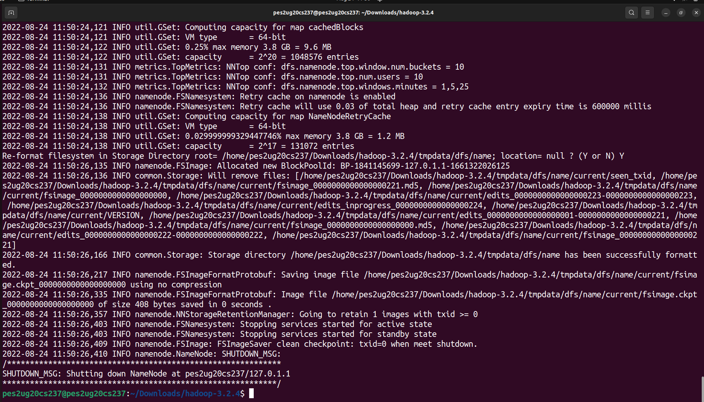
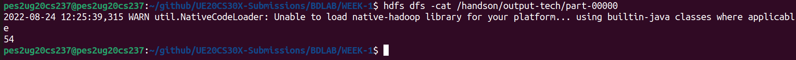

# Hadoop Installation Guide and HDFS Hands On - H1

Every step is to be executed on the home directory. Use `cd` to move to home directory.

The commands in the guide use ```USER``` as the notation for your username. If you have executed A0 correctly, then this should be your SRN in lowercase. This is important since the auto-evaluation depends on it. Verify your username by running `whoami` on the terminal.

Change any `/home/USER/` to `/home/<your SRN>/`

This manual includes steps that you will be doing in the classroom. It assumes that you have completed the downloads and installation steps 1-2 from your home which was emailed earlier. If you have not completed these steps, then click [here](https://github.com/Cloud-Computing-Big-Data/UE20CS322-H1/blob/main/H1_HOME.md) to do so.

Execute the following commands to move to the home directory and updating the package list and the system. This guide assumes that you are working with Ubuntu or a Debian based distribution.
```bash
cd
sudo apt update -y
sudo apt upgrade -y
```

## Step number continues from the H1_HOME manual.

## Step 3 - Format HDFS NameNode

Before starting Hadoop for the first time, the namenode must be formatted. Use the following command.
```bash
hdfs namenode -format
```

A `SHUTDOWN` message will signify the end of the formatting process.

If you have reached this stage, it signifies that you have successfully installed hadoop.

Take a screenshot of the terminal output indicating the shutdown message and name it 3a.png.



## Step 4 - Starting Hadoop

Navigate to the ```hadoop``` folder and execute the following commands. ``start-all.sh`` is a shell script that is used to start all the processes that hadoop requires.

```bash
cd
cd hadoop-3.3.3/sbin/
./start-all.sh
```

Type `jps` to find all the Java Processes started by the shell script. You should see a total of 6 processes, including the `jps` process. Note that the order of the items and the process IDs will be different.

```bash
2994 DataNode
3219 SecondaryNameNode
3927 Jps
3431 ResourceManager
2856 NameNode
3566 NodeManager
```

Take a screenshot of the terminal output and name it 4a.png.


## Step 5 - Accessing Hadoop from the Browser
You can access Hadoop on ```localhost  ``` on the following ports
* NameNode - http://localhost:9870
* DataNode - http://localhost:9864
* YARN Manager - http://localhost:8088

## Step 6 - Hadoop Examples
We will be using the Wordcount example to demonstrate the usage of Hadoop.
Create a text file named ```input.txt``` with any content you want. Next, we will put this to the HDFS folder ```/example``` with the following command.
```bash
hdfs dfs -mkdir /example
hdfs dfs -put input.txt /example
```
Run the following command for the wordcount example.
```bash
hadoop jar $HADOOP_HOME/share/hadoop/mapreduce/hadoop-mapreduce-examples-3.3.3.jar wordcount /example/input.txt /example/output
```
You can check the output with the following command.
```bash
hdfs dfs -cat /example/output/part-r-00000
```

Take a screenshot of the terminal output and name it 6a.png.


## Step 7 - Running Custom WordCount
Now, we will run a sample HDFS commmand to calculate the frequency of a particular word in a text file using our own mapper and reducer files.

Firstly, clone the GitHub repository.
```bash
git clone https://github.com/Cloud-Computing-Big-Data/UE20CS322-H1.git
```
This repo contains a sample mapper, reducer and a dataset file named tech.txt.
Run the following commands to setup HDFS directories and copy the dataset file to the HDFS.

```bash
cd UE20CS322-H1/
hdfs dfs -mkdir /handson
hdfs dfs -put tech.txt /handson
chmod +x *.py
```

Next, run the following command to run the wordcount program.

```bash
hadoop jar /home/USER/hadoop-3.3.3/share/hadoop/tools/lib/hadoop-streaming-3.3.3.jar \
    -mapper "$PWD/mapper.py" \
    -reducer "$PWD/reducer.py 'perseus'" \
    -input /handson/tech.txt \
    -output /handson/output-tech
```

To check the output, execute the following command.

```bash
hdfs dfs -cat /handson/output-tech/part-00000
```

Take a screenshot of the terminal output and name it 7a.png.



## Step 8 - Auto-evaluation
Auto-evaluation is allowed only once. So make sure you have the following checklist ticked before proceeding.
* [ ] JPS has 6 processes(including the JPS process)
* [ ] Step 7 - Running Custom WordCount - Output is correct

For RR campus students, run the following command
```bash
python3 eval-rr.pyc
```

For EC campus students, run the following command
```bash
python3 eval-ec.pyc
```

You can see your score in the terminal output after the program finishes.

To stop all processes when you are done with your work, execute the following command.

```bash
cd
cd hadoop-3.3.3/sbin/
./stop-all.sh
```

## Step 9 - Final Assessment
Make a word document with all the screenshots from HOME and in-person sessions.
Your file should be named with the format ```PES1UG20CS999.pdf``` with your SRN.

Submission link for RR Campus: [here](https://forms.gle/hiX1rheNnyxQgDMh6)<br>
Submission link for EC Campus: [here](https://forms.gle/AN2h3FDXSKjq4N6i9)