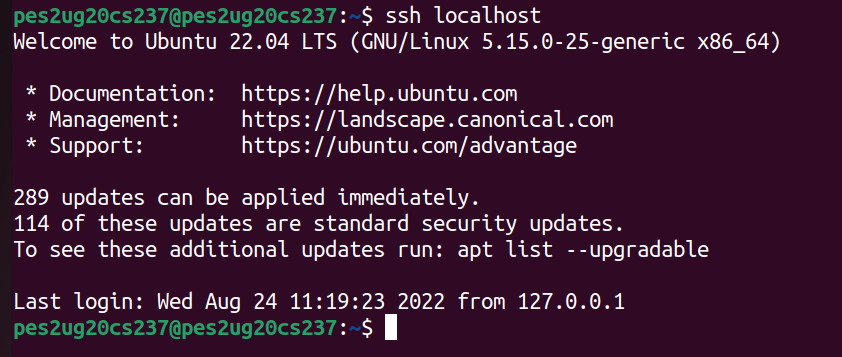
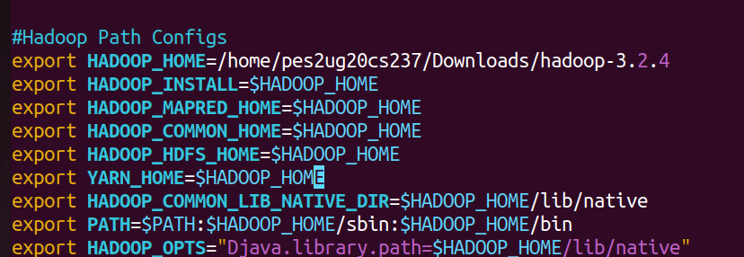
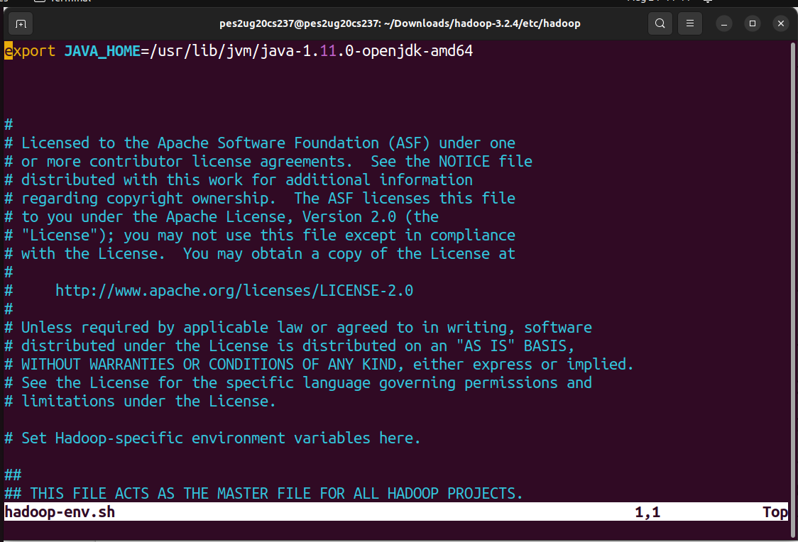
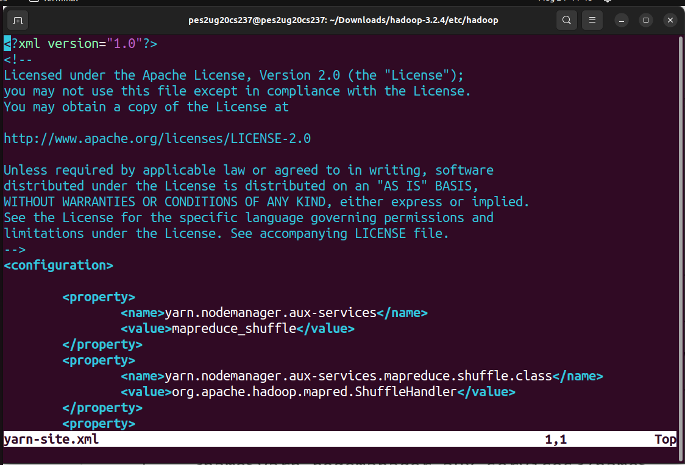

# WEEK-1 BDLAB Submission 
- Name : P K Navin Shrinivas
- SRN : PES2UG20CS237
- Section : D 

## Screenshots : 

### ssh without password : 

### Bashrc :

### Hadoop-env.sh :

### core-site.xml :

### hdfs-site.xml :

### mapred-site.xml :

### yarn-site.xml :

### Formatting namenode : 

### JPS output 

### MapReduce job output 1 : 

### MapReduce job output 2 : 

