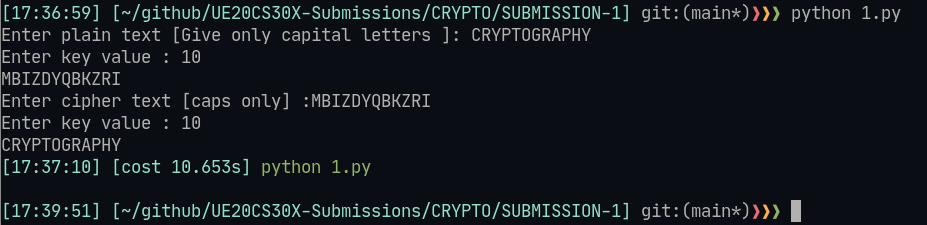
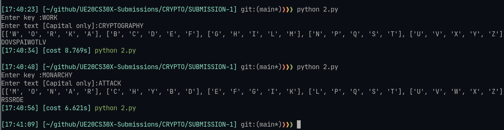

# Lab 01 - Applied Cryptography | Working wihth logical ciphers

- Name : P K Navin Shrinivas
- SRN : PES2UG20CS237
- Section : D

## 1 | Ceaser Cipher 

#### Code :
```py
# Ceaser cipher
plaintext = str(input("Enter plain text [Give only capital letters ]: "))
key = int(input("Enter key value : "))
cipher_text = ""

for i in plaintext:
    plain_char_ascii = ord(i)
    added_ascii = plain_char_ascii+key
    if added_ascii > 90:
        added_ascii = (added_ascii%90)+64
    cipher_text += chr(added_ascii)

print(cipher_text)


cipher = str(input("Enter cipher text [caps only] :"))
key = int(input("Enter key value : "))
plain_text =""
for i in cipher:
    cipher_char_ascii = ord(i)
    added_ascii = cipher_char_ascii-key
    if added_ascii < 65:
        added_ascii = 90-(64-added_ascii)
    plain_text += chr(added_ascii)

print(plain_text)
```

### Screenshots :



## 2 | Playfair Cipher

### Code :
```py
# Play fair cipher

# Helper functions
def samerow(key_mat,letter_1, letter_2):
    for i in range(0,len(key_mat)):
        if letter_1 in key_mat[i] and letter_2 in key_mat[i]:
            return True, i, key_mat[i].index(letter_1), key_mat[i].index(letter_2)
    return False, 0,0,0

def samecol(key_mat,letter_1, letter_2):
    for i in range(0,len(key_mat)):
        for j in range(0,len(key_mat[i])):
            if letter_1 == key_mat[i][j] :
                for k in key_mat:
                    if letter_2 == k[j]:
                        return True, j, i, key_mat.index(k)
            if letter_2 == key_mat[i][j] :
                for k in key_mat:
                    if letter_1 == k[j]:
                        return True, j, i, key_mat.index(k)
    return False, 0, 0, 0

def diffplace(key_mat, letter_1, letter_2):
    row1 = 0
    col1 = 0
    row2 = 0
    col2 = 0
    for i in range(0,len(key_mat)):
        for j in range(0,len(key_mat[i])):
            if key_mat[i][j] == letter_1 :
                row1 = i
                col1 = j
    for i in range(0,len(key_mat)):
        for j in range(0,len(key_mat[i])):
            if key_mat[i][j] == letter_2 :
                row2 = i
                col2 = j
    return True, row1, col1, row2, col2

# Main function :


key = str(input("Enter key :"))
alhpa = "ABCDEFGHIKLMNOPQRSTUVWXYZ" # Note : J is not being included in this string
flattend_key = []
for i in key : 
    flattend_key.append(i)

for i in alhpa:
    if i not in flattend_key:
        flattend_key.append(i)
key_mat = [[],[],[],[],[]]
for i in range(0,len(flattend_key)):
    i_index = int(i/5)
    key_mat[i_index].append(flattend_key[i])
plain_text = str(input("Enter text [Capital only]:"))

chipher_text = ""

plain_pairs = []
print(key_mat)
i = 0;
while i < len(plain_text):
    letter_1 = plain_text[i]
    letter_2 = plain_text[i+1]
    if letter_1 == letter_2 :
        letter_2 = x
    status, row, col1, col2 = samerow(key_mat,letter_1,letter_2)
    if status:
        chipher_text += key_mat[row][col2] + key_mat[row][col2+(col2-col1)%5]
        i+=2
        continue

    status, col, row1, row2 = samecol(key_mat,letter_1,letter_2)
    if status:
        chipher_text += key_mat[row2][col] + key_mat[row2+(row2-row1)%5][col]
        i+=2
        continue

    status, row1, col1, row2, col2 = diffplace(key_mat ,letter_1,letter_2)
    if status:
        chipher_text += key_mat[row1][col2]+key_mat[row2][col1]
        i+=2
        continue
print(chipher_text)
```

### Screenshots :

