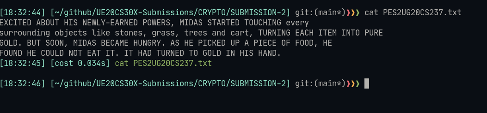
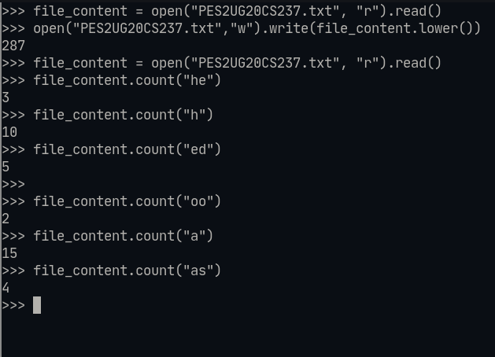
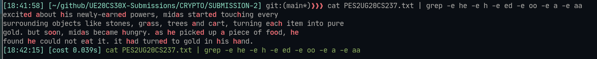
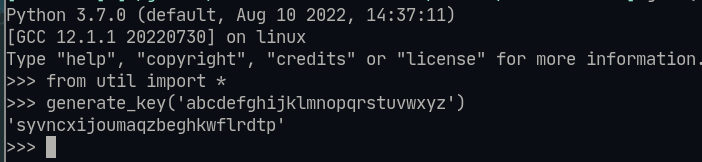
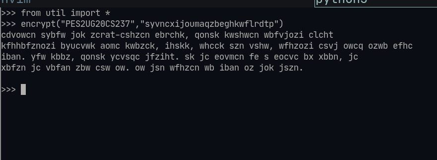
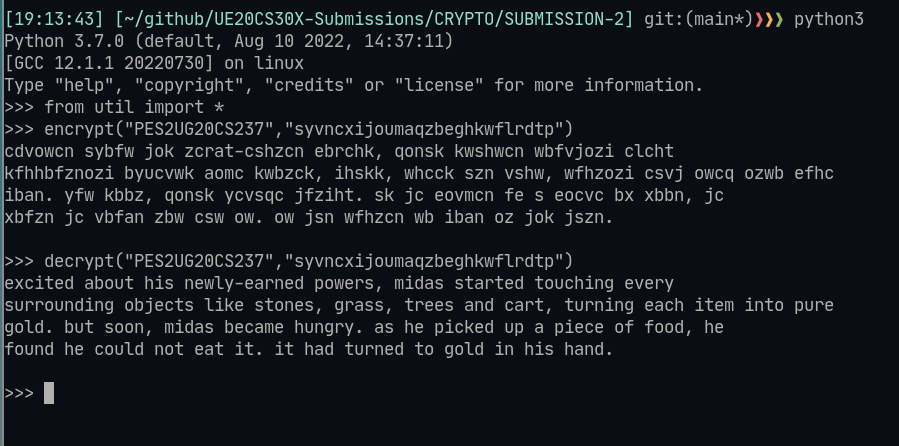
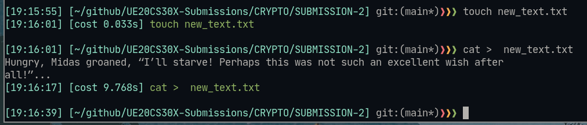
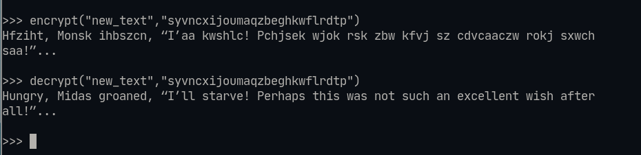

# Lab02 Submission

## Details : 
- Name : P K Navin Shrinivas
- SRN : PES2UG20CS237
- Section : D

## Question 1 :


## Question 2 : 

### Frequencies : 

```
he  3
h   10
ed  5
oo  2
a   15
as  4
```


## Question 3 : 



## Question 4 : 


Substitution Key : `syvncxijoumaqzbeghkwflrdtp`

## Question 5 :

### Plain text : 
excited about his newly-earned powers, midas started touching every
surrounding objects like stones, grass, trees and cart, turning each item into pure
gold. but soon, midas became hungry. as he picked up a piece of food, he
found he could not eat it. it had turned to gold in his hand.

### Encrypted text : 
cdvowcn sybfw jok zcrat-cshzcn ebrchk, qonsk kwshwcn wbfvjozi clcht
kfhhbfznozi byucvwk aomc kwbzck, ihskk, whcck szn vshw, wfhzozi csvj owcq ozwb efhc
iban. yfw kbbz, qonsk ycvsqc jfziht. sk jc eovmcn fe s eocvc bx xbbn, jc
xbfzn jc vbfan zbw csw ow. ow jsn wfhzcn wb iban oz jok jszn.



## Question 6 : 


## Question 7  :



*Observation* : All the double quotes not being part of alphabet remain unencrypted, More over not converting to lower case keeps it unchanged in the cipher text

## Code used for all of the above excersises : 

```py
def check_key_validity ( key , alphabet ) :
   if len ( key ) != len ( alphabet ) :
       return false
   if len ( list ( key ) ) != len ( set ( key ) ) :
        return false
   return True


def generate_key ( alphabet_string ) :
    import random as r
    l = list ( alphabet_string )
    r.shuffle ( l )
    return ''.join ( l )

def encrypt(srn, key):
    fd = open(srn+".txt", "r")
    file_content = str(fd.read())
    fd.close()
    alphabet = "abcdefghijklmnopqrstuvwxyz"
    cipher_text = ''

    for i in range(0,len(file_content)):
        letter = file_content[i]
        if letter not in alphabet:
            cipher_text += letter
        else:
            cipher_text += key[alphabet.index(letter)]
    fd = open(srn+"_enc.txt", "w+")
    fd.write(str(cipher_text))
    fd = open(srn+"_enc.txt", "r")
    print(fd.read())
    return

def decrypt(srn, key):
    fd = open(srn+"_enc.txt", "r")
    file_content = str(fd.read())
    fd.close()
    alphabet = "abcdefghijklmnopqrstuvwxyz"
    plain_text = ""

    for i in range(0,len(file_content)):
        letter = file_content[i]
        if letter not in key:
            plain_text += letter
        else:
            plain_text += alphabet[key.index(letter)]
    fd = open(srn+"_dec.txt", "w+")
    fd.write(str(plain_text))
    fd = open(srn+"_dec.txt", "r")
    print(fd.read())
    return
```
