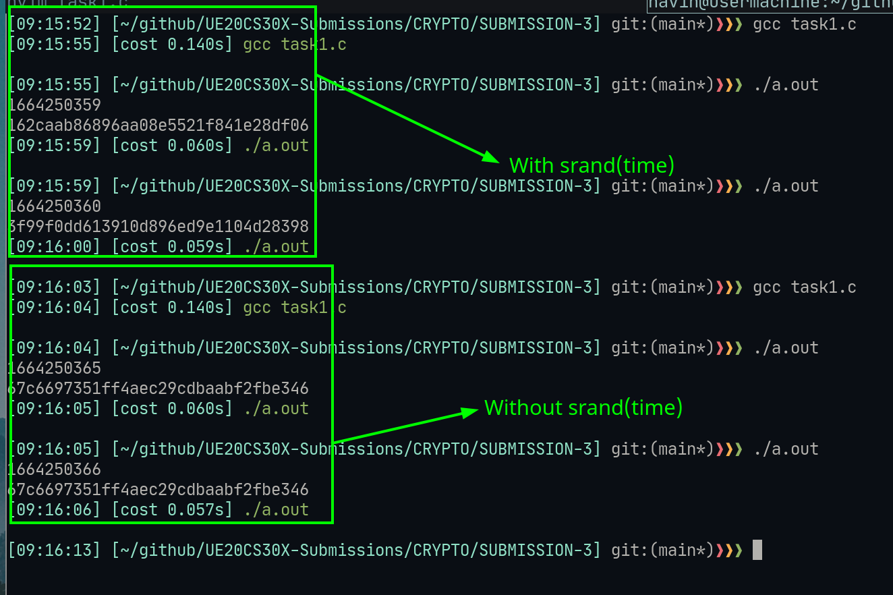
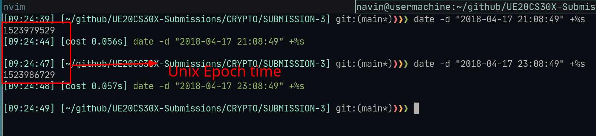
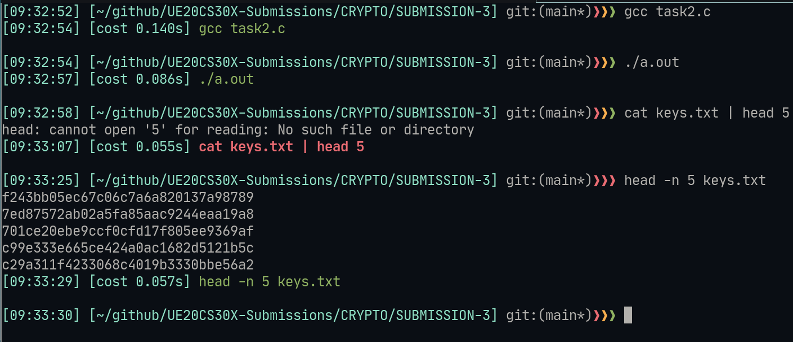
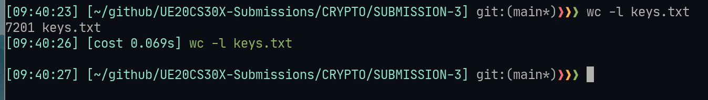
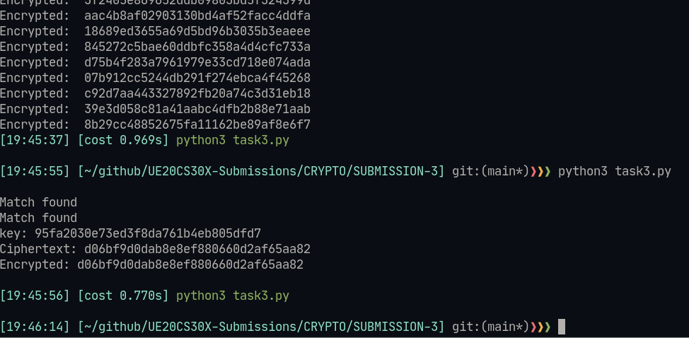
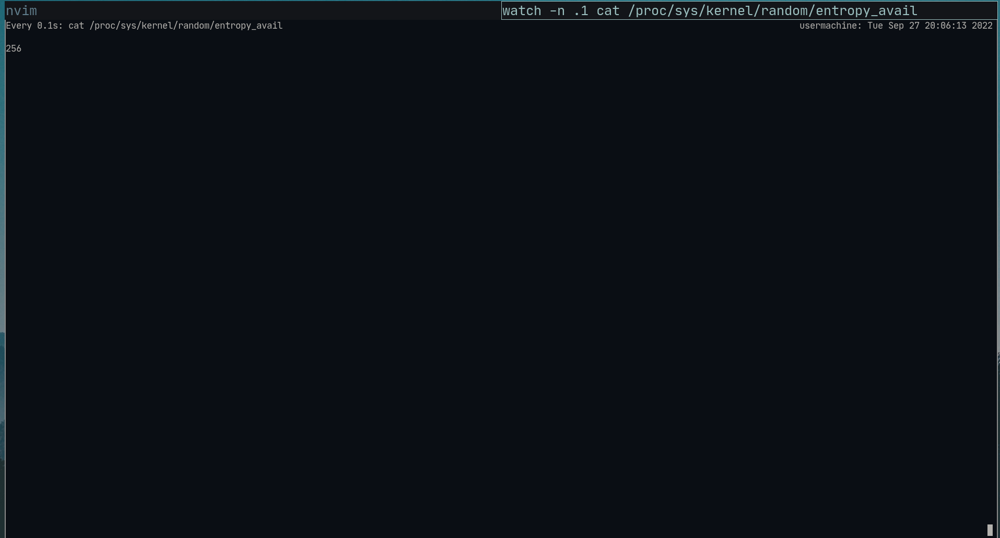
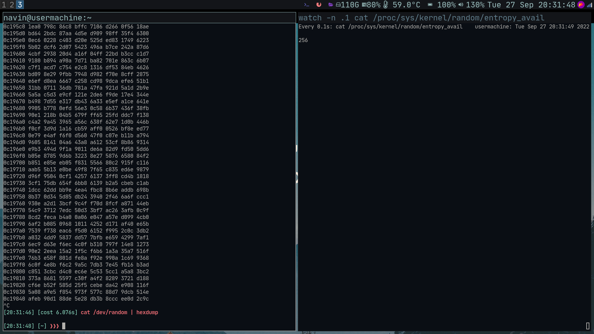
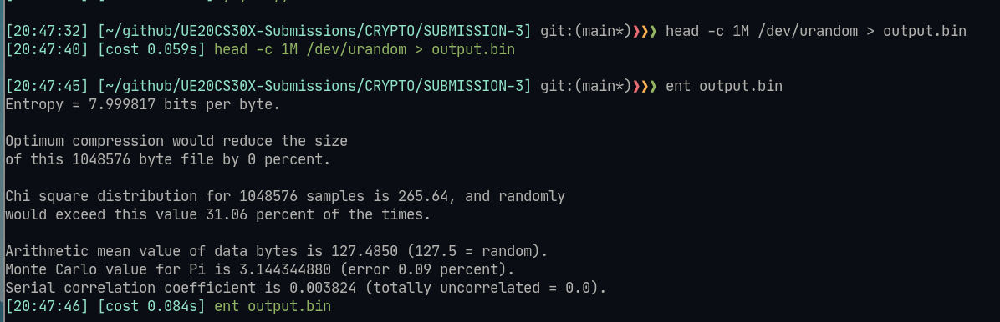
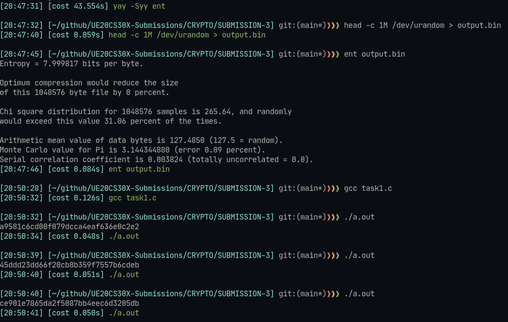

# Cryptograhphy Hands-On submission 3 

## Details : 

- SRN : PES2UG20CS237
- Name : P K Navin Shrinivas 
- Section : D

## Task 1 : Generating prng the wrong way 

#### Screenshot : 


#### Observation : 

- The time stamp is being used as key for the 
- If srand(time()) is removed, then the generated number remains the same

## Task 2 : Guessing the key 

### Step 1 : getting UNIX time to bruteforce decryption

#### Screenshot : 


#### Observation : 
- Above two are the UNIX epoch timestamps using which we generate all possible keys for decrypting
- The above two are different from the ones shown in video as I am using IST and not UTC on the contrary. Do note the times in code is following UTC.

### Step 2 : Bruteforce decrypting

#### Code : 

```c
/* task2.c */
#include <stdio.h>
#include <stdlib.h>
#include <time.h>
#define KEYSIZE 16
void main() {
  int i, j;
  FILE *f;
  char key[KEYSIZE];
  int value1, value2;
  value1 = 1524013729;
  value2 = 1524020929;
  f = fopen("keys.txt", "w");
  for (j = value1; j <= value2; j++) {
    srand (j);
    for (i = 0; i< KEYSIZE; i++) {
      key[i] = rand()%256;
      fprintf(f, "%.2x", (unsigned char)key[i]);
    }
    fprintf(f,"\n");
  }
}
```

#### Screenshot : 




#### Observation :

- Here we have generated all possible keys (of which few are seen in the Screenshot) that are possible between the two time stamps 
- We also see we have 7200 keys which we will be using for bruteforce

### Step 3 : Breaking encrpyted text 

#### Screenshot : 



## task 3 : Seeing kernel entropy : 

#### Screenshot : 


#### Observation : 
- The change in entropy is too little and very rapid

## Task 4 : /dev/urandom : 

#### Screenshot :


#### Observation : 
- On mouse movement we see large change in generate hex dump

## Task 5 : /dev/urandom : 

### Step 1 : 

#### Screenshot :


#### Observation : 
- On mouse movement we see large change in generate hex dump

### Step 2 : Generate random and check quality 

#### Screenshot : 


#### Observation : 
- Here we stats about the random number generated through /dev/urandom 

### Step 3 : Using dev/uradom in task 1 : 

#### Screenshot : 


#### Observation : 
- Here we see that the generated ranomd number done see to follow a patterns unlike before when we did using timestamps.
