# Cryptograhphy Hands-On submission 4 | RSA

## Details : 

- SRN : PES2UG20CS237
- Name : P K Navin Shrinivas 
- Section : D

## Task 1 : BIGNUM

### Screenshots : 
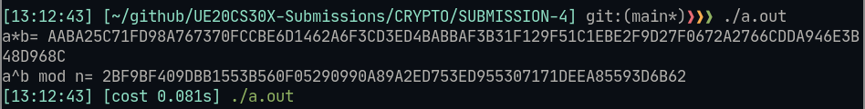

### Code : 
```c
#include <stdio.h>
#include <openssl/bn.h>
#define NBITS 256
void printBN(char*msg, BIGNUM*a) {
  char* number_str = BN_bn2hex(a);
  printf("%s %s\n",msg,number_str);
  OPENSSL_free(number_str);
}
int main() {
  BN_CTX *ctx = BN_CTX_new();
  BIGNUM *a = BN_new();
  BIGNUM *b = BN_new();
  BIGNUM *n = BN_new();
  BIGNUM *res = BN_new();
  // Initialize
  BN_generate_prime_ex(a,NBITS,1,NULL,NULL,NULL);
  BN_dec2bn(&b,"273489463796838501848592769467194369268");
  BN_rand(n,NBITS,0,0);
  // res = a*b
  BN_mul(res,a,b,ctx);
  printBN("a*b=",res);
  // res = a^b mod n
  BN_mod_exp(res,a,b,n,ctx);
  printBN("a^b mod n=",res);
  return 0;
}
```
### Observation : 

- We were able to multiply and do operations over VERY LARGE number usingn BIGNUM. Which otherwise is not possible in C integers.
- Also, we note that all the big number when converted from binary to other formats are stored in char* (string) type.

## TASK 2 : Calclatuing pivate key given P, Q and E

### Screenshots : 
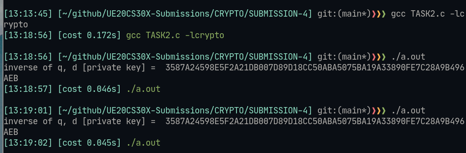

### Code : 
```c
#include <stdio.h>
#include <openssl/bn.h>
#define NBITS 256
void printBN(char*msg, BIGNUM*a) {
  char* number_str = BN_bn2hex(a);
  printf("%s %s\n",msg,number_str);
  OPENSSL_free(number_str);
}
int main() {
  BN_CTX *ctx = BN_CTX_new();
  BIGNUM *p = BN_new();
  BIGNUM *q = BN_new();
  BIGNUM *e = BN_new();
  BIGNUM *d = BN_new();
  BIGNUM *p_minus_one = BN_new();
  BIGNUM *q_minus_one = BN_new();
  BIGNUM *phi_pq = BN_new();
  BIGNUM *one = BN_new();
  // Initialize
  BN_hex2bn(&p,"F7E75FDC469067FFDC4E847C51F452DF");
  BN_hex2bn(&q,"E85CED54AF57E53E092113E62F436F4F");
  BN_hex2bn(&e,"0D88C3");
  BN_hex2bn(&one,"1");
  BN_sub(p_minus_one,p,one);
  BN_sub(q_minus_one,q,one);
  BN_mul(phi_pq,p_minus_one,q_minus_one,ctx);
  BN_mod_inverse(d,e,phi_pq,ctx);
  printBN("inverse of q, d [private key] = ",d);
  return 0;
}
```

### Observation : 

- Given p,q and e. Calculation of private key d is very easy, almost and constant time process.
- It remains constant for a given set of p, q and e. 
- In the absense of any one p, q and e, calculating d becomes exponentially harder.
- Cacluating inverse of e in mod space of phi becomes easier as calculating phi of a number whos prime constituents (p*q) is easy and is simply (p-1)*(q-1). Finding the two primes that constitutes a non-prime number is pretty much a hit or trial method.

## TASK 3 : Encrpyting and Decrypting a message using RSA. 

### Screenshots : 
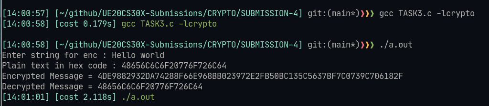

### Code : 
> Note : The code has been modified, in such a way that it take input from user, converts to hex and does RSA operations on the same!

```c
#include <stdio.h>
#include <openssl/bn.h>
#define NBITS 256


void alphabets_to_hexcode(char* string, char* res){
  int i = 0;
  int out = 0;
  while(string[i]) {
    sprintf((char*)(res+out),"%02X",string[i]);
    out+=2;
    i++;
  }
}

void printBN(char*msg, BIGNUM*a) {
  char* number_str = BN_bn2hex(a);
  printf("%s %s\n",msg,number_str);
  OPENSSL_free(number_str);
}
int main() {
  BN_CTX *ctx = BN_CTX_new();
  BIGNUM *m = BN_new();
  BIGNUM *e = BN_new();
  BIGNUM *n = BN_new();
  BIGNUM *d = BN_new();
  BIGNUM *enc = BN_new();
  BIGNUM *dec = BN_new();

  char string[100];
  char res[100];
  printf("Enter string for enc : ");
  scanf("%[^\n]%*c",string);
  alphabets_to_hexcode(string,res);

  printf("Plain text in hex code : ");

  int out_print = 0;
  while(res[out_print]){
    printf("%c", res[out_print]);
    out_print++;
  }
  printf("\n");

  // Initialize
  BN_hex2bn(&m,res);
  BN_hex2bn(&e,"010001");
  BN_hex2bn(&n,"DCBFFE3E51F62E09CE7032E2677A78946A849DC4CDDE3A4D0CB81629242FB1A5");
  BN_hex2bn(&d,"74D806F9F3A62BAE331FFE3F0A68AFE35B3D2E4794148AACBC26AA381CD7D30D");
  // Encryption
  BN_mod_exp(enc,m,e,n,ctx);
  printBN("Encrypted Message =",enc);
  // Decryption
  BN_mod_exp(dec,enc,d,n,ctx);
  printBN("Decrypted Message =",dec);
  return 0;
}
```

### Observation :  
- None, except for the fact that RSA indeed works!

## TASK 4 : Decryption of a hex code

### Screenshots : 
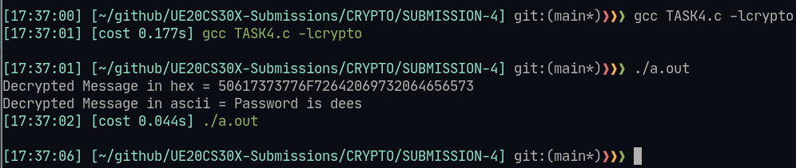

### Code : 
> Note : this is modified code to also pint ascii equivalent of hex code!
```c
#include <stdio.h>
#include <openssl/bn.h>
#define NBITS 256

void hex_to_string(char* msg, char* hex)
{
   int hex_sz = 0;
   while(hex[hex_sz]){
     hex_sz+=1;
   }
   int msg_sz = (hex_sz/2)+1;
   if (hex_sz % 2 != 0 || hex_sz/2 >= msg_sz)
      return;

   for (int i = 0; i < hex_sz; i+=2)
   {
      uint8_t msb = (hex[i+0] <= '9' ? hex[i+0] - '0' : (hex[i+0] & 0x5F) - 'A' + 10);
      uint8_t lsb = (hex[i+1] <= '9' ? hex[i+1] - '0' : (hex[i+1] & 0x5F) - 'A' + 10);
      msg[i / 2] = (msb << 4) | lsb;
      msg[i+1] = '\0';
   }
}
void printBN(char*msg, BIGNUM*a) {
  /* Use BN_bn2hex(a) for hex string
     Use BN_bn2dec(a) for decimal string*/
  char* number_str = BN_bn2hex(a);
  char res[100];
  hex_to_string(res,number_str);
  printf("%s in hex = %s\n",msg,number_str);
  printf("%s in ascii = %s\n",msg,res);
  OPENSSL_free(number_str);
}

int main() {
  BN_CTX *ctx = BN_CTX_new();
  BIGNUM *m = BN_new();
  BIGNUM *e = BN_new();
  BIGNUM *n = BN_new();
  BIGNUM *d = BN_new();
  BIGNUM *enc = BN_new();
  BIGNUM *dec = BN_new();
  // Initialize
  BN_hex2bn(&n,"DCBFFE3E51F62E09CE7032E2677A78946A849DC4CDDE3A4D0CB81629242FB1A5");
  BN_hex2bn(&d,"74D806F9F3A62BAE331FFE3F0A68AFE35B3D2E4794148AACBC26AA381CD7D30D");
  BN_hex2bn(&enc,"8C0F971DF2F3672B28811407E2DABBE1DA0FEBBBDFC7DCB67396567EA1E2493F"
      );
  // Decryption
  BN_mod_exp(dec,enc,d,n,ctx);
  printBN("Decrypted Message",dec);
  return 0;
}
```

### Observation : 
- Given d, which is the modular inverse of e. Decryption is very easy, all we needs to do is enc^d % n;

## TASK 5 : Getting signature of a string 

### Screenshots : 
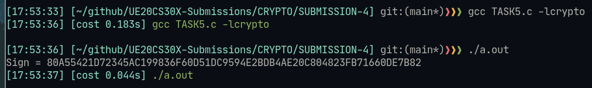

> Note : Instead of using python for step 1, ive included a function in C to convert plain text to hex code!

### Code : 

```c
#include <stdio.h>
#include <openssl/bn.h>
#define NBITS 256

void alphabets_to_hexcode(char* string, char* res){
  int i = 0;
  int out = 0;
  while(string[i]) {
    sprintf((char*)(res+out),"%02X",string[i]);
    out+=2;
    i++;
  }
}

void printBN(char*msg, BIGNUM*a) {
  /* Use BN_bn2hex(a) for hex string
     Use BN_bn2dec(a) for decimal string*/
  char* number_str = BN_bn2hex(a);
  printf("%s %s\n",msg,number_str);
  OPENSSL_free(number_str);
}
int main() {
  BN_CTX *ctx = BN_CTX_new();
  BIGNUM *m = BN_new();
  BIGNUM *n = BN_new();
  BIGNUM *d = BN_new();
  BIGNUM *sign = BN_new();
  // Initialize
  char hex_code[1000];
  char plain_text[] = "I owe you $2000";
  alphabets_to_hexcode(plain_text, hex_code);
  BN_hex2bn(&m,hex_code);
  BN_hex2bn(&n,"DCBFFE3E51F62E09CE7032E2677A78946A849DC4CDDE3A4D0CB81629242FB1A5");
  BN_hex2bn(&d,"74D806F9F3A62BAE331FFE3F0A68AFE35B3D2E4794148AACBC26AA381CD7D30D");
  // Signing
  BN_mod_exp(sign,m,d,n,ctx);
  printBN("Sign =",sign);
  return 0;
}
```

### Observation : 

- A point clearly observed is that the signature is much bigger than plain text, this maybe due to the fact of avalance effect.

## TASK 6 : Verifying the previous signature 

### Screenshots : 
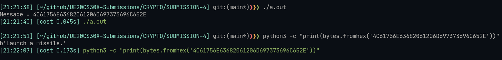

### Observation : 

- We can observe a valid string sequence that come out of signature verification. Implying that it is indeed Alice's signature.

## TASK 7 : Verifying X.509 certificate

### Step 1 : 

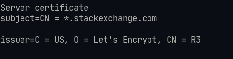
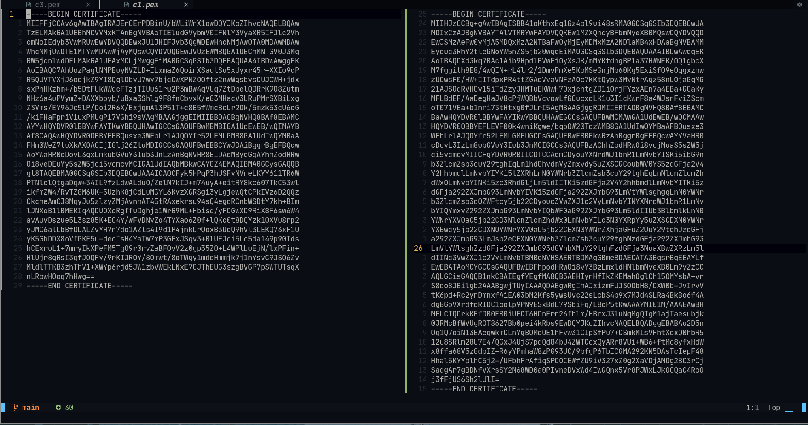

- Here we see certificates from stackexchange.com. This particular website has been chosen as it uses RSA standards for encryption.

### Step 2 : 
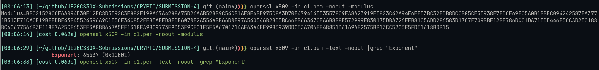

- Here we see the modulus (n) ans also the exponent value (e)

### Step 3 : 

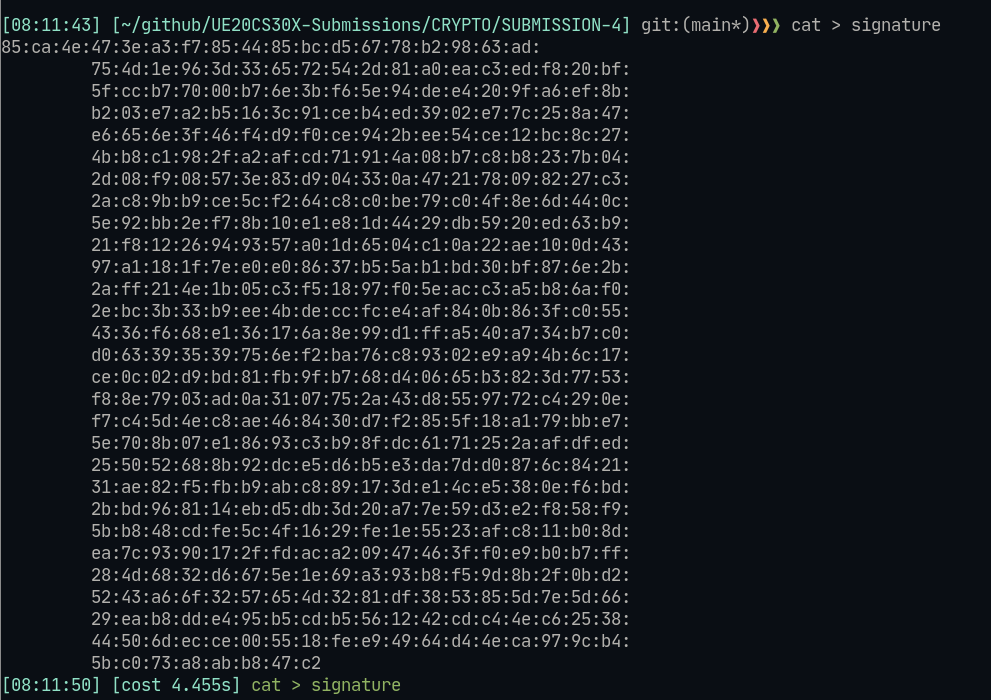
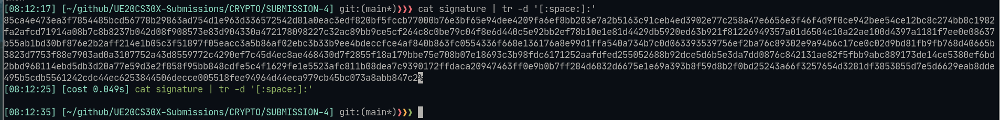

- Siganture type is RSA, but it was not possible to pull ouot signature using grep, hence we will have to printout the entire info.
- Doing cat on signature file ignoring space and ":", we get the siganture as a block of hex code.

### Step 4 : 

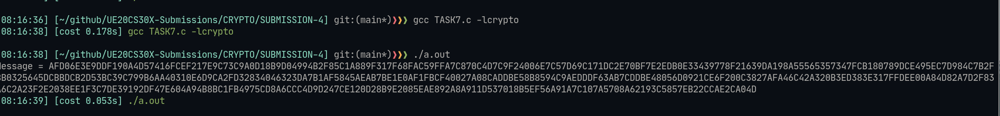

**Code :**
```c
#include <stdio.h>
#include <openssl/bn.h>
#define NBITS 256
void printBN(char*msg, BIGNUM*a) {
  /* Use BN_bn2hex(a) for hex string
     Use BN_bn2dec(a) for decimal string*/
  char* number_str = BN_bn2hex(a);
  printf("%s %s\n",msg,number_str);
  OPENSSL_free(number_str);
}
int main() {
  BN_CTX *ctx = BN_CTX_new();
  BIGNUM *s = BN_new();
  BIGNUM *n = BN_new();
  BIGNUM *e = BN_new();
  BIGNUM *message = BN_new();
  // Initialize
  BN_hex2bn(&s,"85ca4e473ea3f7854485bcd56778b29863ad754d1e963d336572542d81a0eac3edf820bf5fccb77000b76e3bf65e94dee4209fa6ef8bb203e7a2b5163c91ceb4ed3902e77c258a47e6656e3f46f4d9f0ce942bee54ce12bc8c274bb8c1982fa2afcd71914a08b7c8b8237b042d08f908573e83d904330a472178098227c32ac89bb9ce5cf264c8c0be79c04f8e6d440c5e92bb2ef78b10e1e81d4429db5920ed63b921f81226949357a01d6504c10a22ae100d4397a1181f7ee0e08637b55ab1bd30bf876e2b2aff214e1b05c3f51897f05eacc3a5b86af02ebc3b33b9ee4bdeccfce4af840b863fc0554336f668e136176a8e99d1ffa540a734b7c0d063393539756ef2ba76c89302e9a94b6c17ce0c02d9bd81fb9fb768d40665b3823d7753f88e7903ad0a3107752a43d8559772c4290ef7c45d4ec8ae468430d7f2855f18a179bbe75e708b07e18693c3b98fdc6171252aafdfed255052688b92dce5d6b5e3da7dd0876c842131ae82f5fbb9abc889173de14ce5380ef6bd2bbd968114ebd5db3d20a77e59d3e2f858f95bb848cdfe5c4f1629fe1e5523afc811b08dea7c9390172ffdaca20947463ff0e9b0b7ff284d6832d6675e1e69a393b8f59d8b2f0bd25243a66f3257654d3281df3853855d7e5d6629eab8dde495b5cdb5561242cdc44ec6253844506decce005518fee94964d44eca979cb45bc073a8abb847c2");
  BN_hex2bn(&n,"BB021528CCF6A094D30F12EC8D5592C3F882F199A67A4288A75D26AAB52BB9C54CB1AF8E6BF975C8A3D70F4794145535578C9EA8A23919F5823C42A94E6EF53BC32EDB8DC0B05CF35938E7EDCF69F05A0B1BBEC094242587FA3771B313E71CACE19BEFDBE43B45524596A9C153CE34C852EEB5AEED8FDE6070E2A554ABB66D0E97A540346B2BD3BC66EB66347CFA6B8B8F572999F830175DBA726FFB81C5ADD286583D17C7E709BBF12BF786DCC1DA715DD446E3CCAD25C188BC60677566B3F118F7A25CE653FF3A88B647A5FF1318EA9809773F9D53F9CF01E5F5A6701714AF63A4FF99B3939DDC53A706FE48851DA169AE2575BB13CC5203F5ED51A18BDB15");
  BN_hex2bn(&e,"10001");
  // Signing
  BN_mod_exp(message,s,e,n,ctx);
  printBN("Message =",message);
  return 0;
}
```

- Here we see the decrypted message that was used to create this certificate. This would have been taken at random by the certificate provider.
