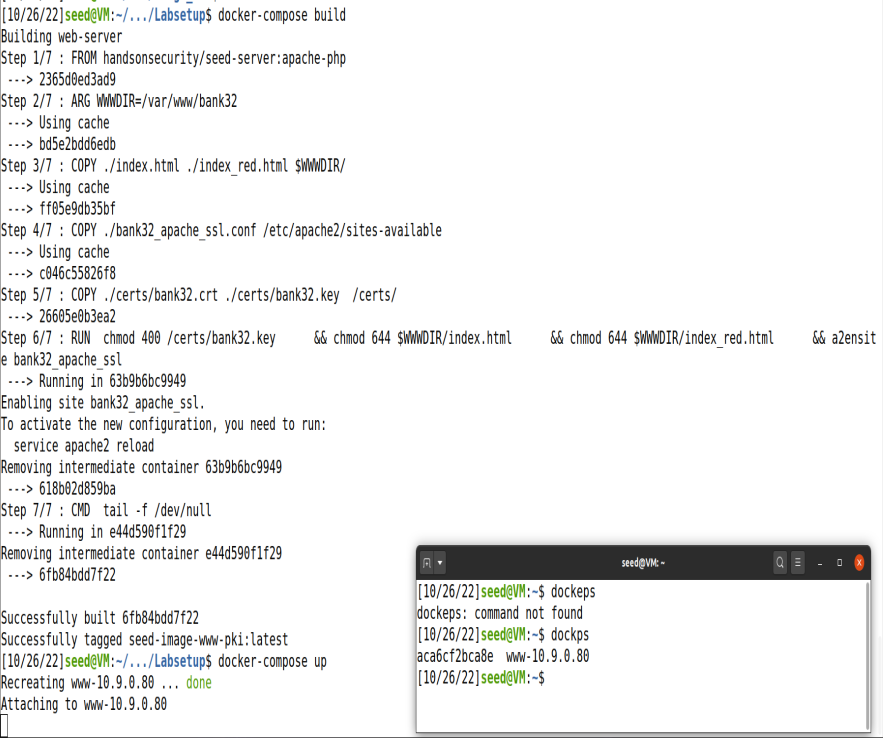

# Cryptograhphy Hands-On submission 5 | PKI

## Details : 

- SRN : PES2UG20CS237
- Name : P K Navin Shrinivas 
- Section : D

## TASK 1 : Becoming a CA

### Screenshots : 

### Observation : 

- Above using openssl, we generate a certificate and a key. On seeing certificate details, we see its a SHA256RSA encrypted certificate. 
- This certificate also hold the modulus and public key parts of this system.
- To see details of private key, one needs the password with which this system was created with. This hold all the private and public parts of the key.

## TASK 2 : Creating priv/pub for requesting certificate.

### Screenshots : 

### Observation : 
- Above we create a csr, that is a certificate request with things that we want the server to enc their private material.
- We also have the priv/pub stuff stored in the .key file.

## TASK 3 : Creating cerificate for our server [From which we will be requesting using previous csr]

### Screenshots : 

### Observation : 

- Above we are creating a certificate acting as www.Bank32.com using the csr that we generated in the previous step, along with serial.

## TASK 4 : Setting up server and setting up for certificate exchange 

### Screenshots and Observations : 

- Above we copy over the certicated for Bank32.com and CA certificates over to the docker file in the apace installtion.

- Above we simply build the docker image and start it.

- Above we are modifying the hosts file for bank32.com such that when queried from dns, we will get a local ip address and resolved address.

- Above we see that firefox gives a warning that the CA is not a trusted one and may be self signed.

- Above we see no such warning as the modelCA.crt certificate was added to the trusted list of certs in firefox.

### Question : 

- Above firefox shows an error code of bad cert domain, why?
- This is bacuse if we see the command that we did to create bank32.com's certificate we used 3 domains, one main domain and 2 alias domains. None of them were the ip address of the server. Firefox verifies if the cerficated are fit by comparing hosts, which in this case is not.
- The three domain this certificate is fit for is : "www.bank32.com","www.bank32A.com","www.bank32B.com"

## TASK 5 : MITM attack 

### Screenshots and Observations : 

- Above we are acting as a CA and creating certificates for www.example.com using csr and crt

- Above we rebuild the docker image with new ssl conf and certificates, one that can serve www.example.com

- Above we are creating fake entries in the hosts dns record file. Usually for MITM attack, this change has to be done programmatically and this rightfully need elevated permissions.

- Above we visit www.example.com in the host machine, as we have added ourselves as trusted CA in the firefox list, we see no warnings come up. The unaware hosts never knows that is isn't the original site. Hence our MITM attack has been executed successfully.

