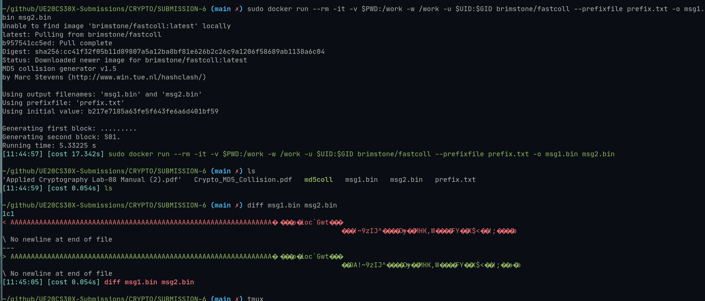
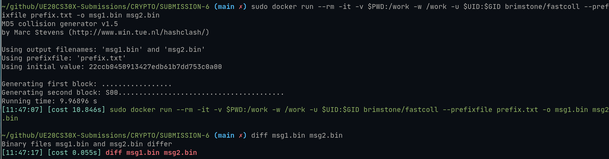
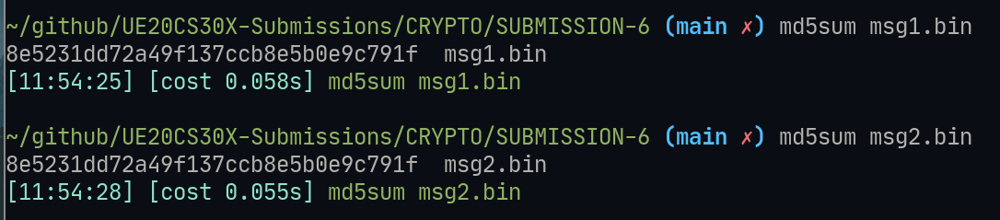
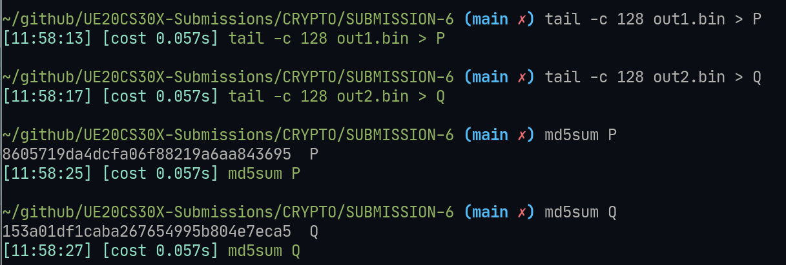
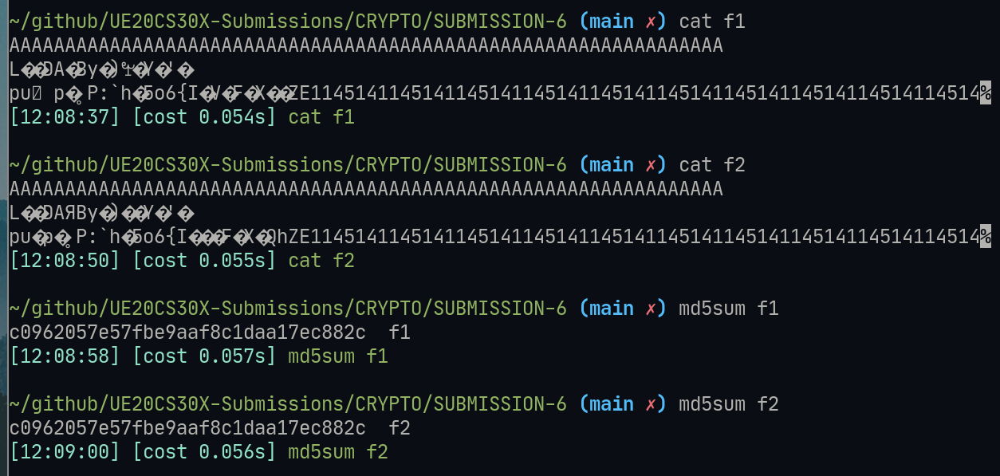
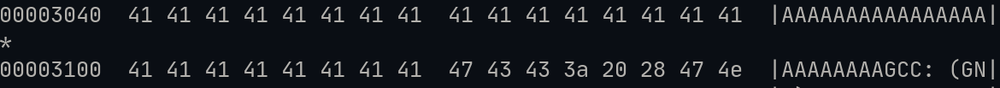
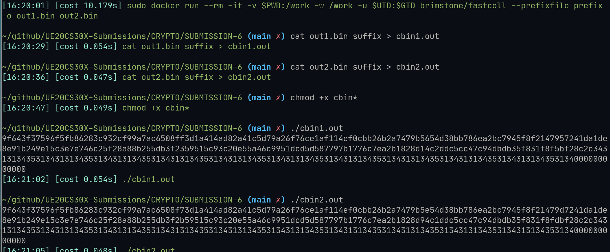
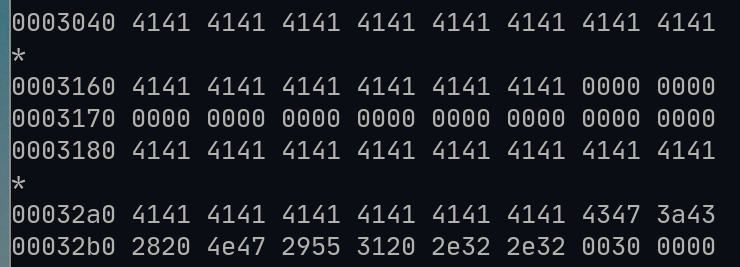
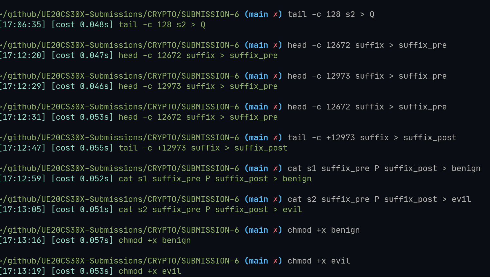

# Cryptograhphy Hands-On submission 6 | MD5

## Details : 

- SRN : PES2UG20CS237
- Name : P K Navin Shrinivas 
- Section : D

## TASK 1 : Creating colliding MD5 hashes

### Screenshots : 

### Observation : 

- When the input file is 64 letter long, the md5 hashes do collide.
- When the input file is not 64 letter long, the md5 hashes do not collide.
- But even when the hashes are diff, the md5sum output is the same

## TASK 2 : Prefix and Suffix collisions

### Screenshots : 

### Observation : 
- postfix of the 2 hashes are not the same as md5sum is turning out to be different
- Using the same post and pre fix leads to same md5 hashes, this is due the same contents in the entire of md5's bit len

## TASK 3 

### Screenshots : 

- Starting index : 12352 
- Endind index : 12553

### Observation : 
- Here we see that using md5colgen we generated 2 program that have the same hash despite their outputs.

## TASK 4 : Changin behaviours of file more drastically.

### Screenshots and Observations : 

- Start : 12552
- End : 12653
- Start of  y : 12672
- End of y : 12973

- Here we observe that the files have been modified and yet their hash remains same and the program cant tell that it has been hacked.

