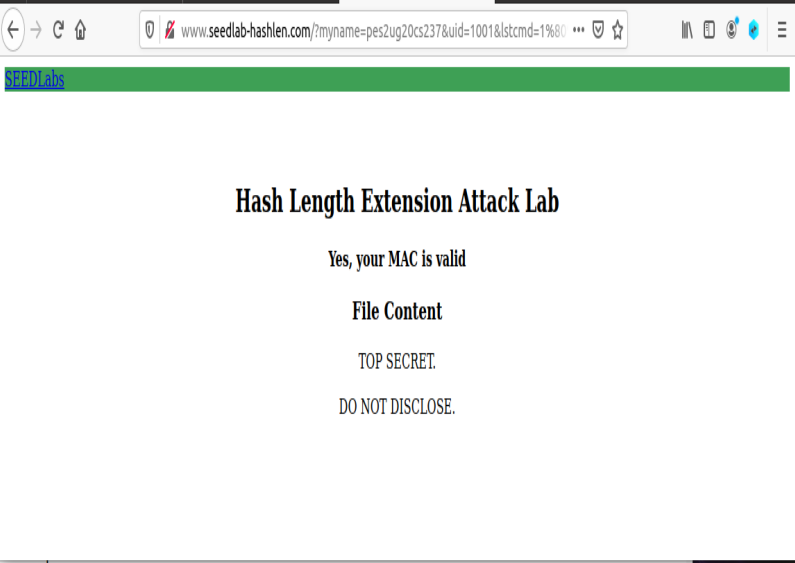

# Hash Length Extension lab | Lab-09

## Details : 

- SRN : PES2UG20CS237
- Name : P K Navin Shrinivas 
- Section : D

## TASK 1 : Seeing MAC in action

### Screenshots : 


### Observation : 
- We observe that MAC is able to authenticate the user, giving wrong sha256sum shows a different web page.

## TASK 2 : Create padding with len

### Data : 
```
\x80\x00\x00\x00\x00\x00\x00\x00\x00\x00\x00\x00\x00\x00\x00\x00\x00\x01\x68
%80%00%00%00%00%00%00%00%00%00%00%00%00%00%00%00%00%01%68
```
### Screenshots : 


### Observation : 
- Here we have gotten the binary encoding and url encoding of the string given along with padded zeros and its len.

## TASK 3 : Length Extension attack

### Data : 

```
67cdeffebbabea5fdbcf00637b6ba419865fbf3c28219943534b5f43a15a3966
http://www.seedlab-hashlen.com/?myname=pes2ug20cs237&uid=1001&lstcmd=1%80%00%00%00%00%00%00%00%00%00%00%00%00%00%00%00%00%01%68&download=secret.txt&mac=67cdeffebbabea5fdbcf00637b6ba419865fbf3c28219943534b5f43a15a3966
```
Trying to do the attack without access to key : 
```
http://www.seedlab-hashlen.com/?myname=pes2ug20cs237&uid=1002&lstcmd=1&mac=17a3cc37a8d2444cd9ecf81bc3b79760bd014de88105890765ab21490f8924e6

\x80\x00\x00\x00\x00\x00\x00\x00\x00\x00\x00\x00\x00\x00\x00\x00\x00\x01\x68
%80%00%00%00%00%00%00%00%00%00%00%00%00%00%00%00%00%01%68

New hash : fc83c563f3b7d50f067c2697fa9d76431ab7b71a0c22a28a01153fc1807bdb22

New request : http://www.seedlab-hashlen.com/?myname=pes2ug20cs237&uid=1002&lstcmd=1%80%00%00%00%00%00%00%00%00%00%00%00%00%00%00%00%00%01%68&mac=fc83c563f3b7d50f067c2697fa9d76431ab7b71a0c22a28a01153fc1807bdb22
```

### Screenshots : 



### Observation : 

- Here we see that even tho the command has some extra padding and len, we were able to get the contents of the file!
- And in the second part, we see that we were able to get contents of the file without even using the key!

## TASK 4 : HMAC, to mitigate length extenstion attack

### Data : 
```
HMAC : bbc9c2aca90ca4c2c5b10a0ceb72646fd15977ae909449d2982e1408cc7e6e90
new request : http://www.seedlab-hashlen.com/?lstcmd=1&uid=1001&myname=pes2ug20cs237&mac=bbc9c2aca90ca4c2c5b10a0ceb72646fd15977ae909449d2982e1408cc7e6e90
```

### Observation 
- As we are using HMAC a length extension attack would have not been possible.


