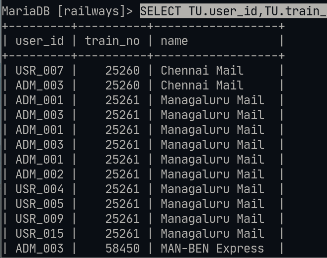

# Lab-5 JOINS :

## Details : 
- SRN : PES2UG20CS237
- Name : P K Navin Shrinivas 
- Section : D

## Question 1 : 

```sql
ALTER TABLE TICKET ADD COLUMN calculate_fare int(11);

CREATE VIEW temp1 AS SELECT pnr,distance,fare_per_km  FROM
> ((TICKET AS tk INNER JOIN ROUTE_INFO AS ri ON departure=from_station_name AND arrival=to_station_name )
> NATURAL JOIN FARE_TABLE);

UPDATE TICKET INNER JOIN temp1 ON temp1.pnr=temp1.pnr 
> SET calculate_fare=temp1.distance*temp1.fare_per_km WHERE TICKET.pnr=temp1.pnr;
```

![image[(./1.png)]

## Question 2 : 

```sql
SELECT from_station_name, to_station_name, distance FROM
    -> TRAIN NATURAL JOIN ROUTE_INFO
    -> WHERE train_no=62621;
```


## Question 3 : 

```sql
SELECT T.train_no,name,compartment_no, C.availability
    ->  FROM (TRAIN AS T INNER JOIN COMPARTMENT AS C ON T.train_no=C.train_no)
    -> WHERE C.availability>10;
```


## Question 4 : 

```sql
SELECT TP.name,T.calculate_fare
    -> FROM (TICKET AS T INNER JOIN TICKET_PASSENGER AS TP ON TP.pnr=T.pnr)
    -> WHERE T.calculate_fare > 500;
```


## Question 5 : 

```sql
SELECT U.fname,U.lname,U.dob,T.pnr FROM
    -> (TICKET AS T LEFT OUTER JOIN USER AS U ON T.user_id=U.user_id);
```


## question 7 : 

```sql
select t.pnr,tp.name,t.travel_date 
from (TICKET as t right outer join TICKET_PASSENGER as tp on t.pnr=tp.pnr);
```


## question 8 : 

```sql
SELECT TU.user_id,TU.train_no,T.name 
FROM (TRAIN AS T RIGHT OUTER JOIN TRAIN_USER AS TU ON TU.train_no=T.train_no);
```



## Question 9 : 
```sql
CREATE VIEW temp3 AS SELECT T.train_no,T.name,T.destination,RI.distance
FROM TRAIN AS T,ROUTE_INFO AS RI
WHERE T.source=RI.from_station_name AND T.destination=RI.to_station_name;

CREATE VIEW temp4 AS SELECT temp3.train_no,name,destination,distance,departure_time 
FROM temp3 JOIN TICKET ON temp3.train_no=TICKET.train_no;

SELECT train_no,name FROM temp4 
WHERE (destination!='Mangaluru' AND distance>100) AND departure_time!='20:00:00';
```


## Question 10 
```sql
SELECT train_no,user_id,departure,arrival,departure_time,calculate_fare 
FROM TICKET WHERE calculate_fare>(SELECT AVG(calculate_fare) FROM TICKET);
```

