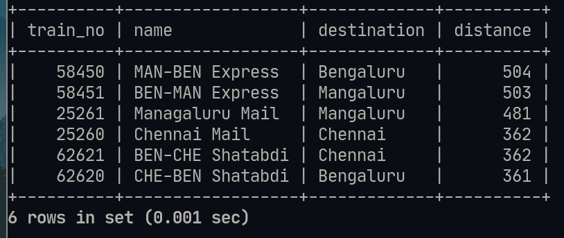

# Lab-6 Aggregates :

## Details : 
- SRN : PES2UG20CS237
- Name : P K Navin Shrinivas 
- Section : D

## Question 1 : 

```sql
SELECT train_no,AVG(distance) FROM ROUTE_INFO GROUP BY train_no;
```


## Question 2 : 

```sql
SELECT train_no,AVG(distance) FROM ROUTE_INFO GROUP BY train_no 
ORDER BY AVG(distance) DESC;
```


## Question 3 : 
```sql
CREATE VIEW temp3 AS SELECT T.train_no,T.name,T.destination,RI.distance 
FROM TRAIN AS T,ROUTE_INFO AS RI 
WHERE T.source=RI.from_station_name AND T.destination=RI.to_station_name;

SELECT * FROM temp3 ORDER BY distance DESC;
```


## Question 4 : 

```sql
CREATE VIEW temp5 AS SELECT train_no,COUNT(compartment_no) AS comp_no 
FROM COMPARTMENT GROUP BY train_no;

SELECT train_no,comp_no FROM temp5 
WHERE comp_no=(SELECT MAX(comp_no) FROM temp5);

SELECT train_no,comp_no FROM temp5 
WHERE comp_no=(SELECT MIN(comp_no) FROM temp5);
```


## Question 5 : 

```sql
SELECT user_id,COUNT(phone_no) AS number_of_phones 
FROM USER_PHONE  
WHERE user_id='ADM_001' OR user_id='USR_006' OR user_id='USR_010' GROUP BY user_id;
```


## Question 6 : 

```sql
SELECT train_type,AVG(fare_per_km) AS Avg_Fare 
FROM FARE_TABLE 
GROUP BY train_type ORDER BY Avg_Fare DESC;
```


## Question 7 :

```sql
SELECT user_id,fname,lname FROM USER WHERE age= (SELECT MAX(age) FROM USER);
```


## Question 8 :

```sql
SELECT COUNT(*) AS number_of_people_with_ullal 
FROM TICKET_PASSENGER WHERE name LIKE '%Ullal%';
```


