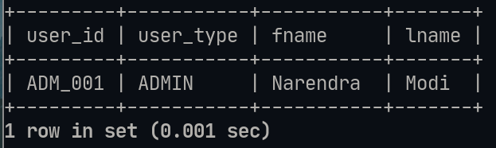

# Lab-7 Set Operations:

## Details : 
- SRN : PES2UG20CS237
- Name : P K Navin Shrinivas 
- Section : D

## Question 1 : 

### Command : 
```sql
 SELECT U.user_id, U.user_type, U.fname, U.lname
 FROM USER AS U, TICKET AS T
 WHERE ((T.user_id=U.user_id AND (T.departure="Bengaluru" AND T.arrival="Chennai")) AND (T.travel_date LIKE '2021-10-__'))
 UNION
 SELECT U.user_id, U.user_type, U.fname, U.lname
 FROM USER AS U, TICKET AS T
 WHERE  ((T.user_id=U.user_id AND (T.departure="Bengaluru" AND T.arrival="Chennai")) AND (T.travel_date LIKE '2022-08-__'));
```

### Screenshot : 


## Question 2 : 

### Command : 

```sql
 SELECT U.user_id, U.user_type, U.fname, U.lname
 FROM USER AS U, TICKET AS T
 WHERE ((T.user_id=U.user_id AND (T.departure="Bengaluru" AND T.arrival="Chennai")) AND (T.travel_date LIKE '2021-10-__')) AND
 EXISTS(
 SELECT U.user_id, U.user_type, U.fname, U.lname
 FROM USER AS U, TICKET AS T
 WHERE  ((T.user_id=U.user_id AND (T.departure="Bengaluru" AND T.arrival="Chennai")) AND (T.travel_date LIKE '2022-08-__')));
```

### Screenshot : 


## Question 3 : 

### Command : 

```sql
SELECT U.user_id, U.user_type, U.fname, U.lname
FROM USER AS U, TICKET AS T  
WHERE ((T.user_id=U.user_id AND (T.departure="Bengaluru" AND T.arrival="Chennai")) AND (T.travel_date LIKE '2022-08-__')) 
AND NOT EXISTS 
(SELECT U.user_id, U.user_type, U.fname, U.lname  
FROM USER AS U, TICKET AS T  
WHERE ((T.user_id=U.user_id AND (T.departure="Bengaluru" AND T.arrival="Chennai")) AND (T.travel_date LIKE '2021-10-__')));
```

### Screenshot : 


## Question 4 : 

### Command : 

```sql
 SELECT U.user_id, U.user_type, U.fname, U.lname
 FROM USER AS U, TICKET AS T
 WHERE ((T.user_id=U.user_id AND (T.departure="Bengaluru" AND T.arrival="Chennai")))
 AND EXISTS 
 (SELECT UA.user_id, UA.user_type, UA.fname, UA.lname 
 FROM USER AS UA, TICKET AS TA  
 WHERE ((TA.user_id=UA.user_id AND (TA.departure="Chennai" AND TA.arrival="Bengaluru")) 
 AND (TA.travel_date BETWEEN T.travel_date AND DATE_ADD(T.travel_date, INTERVAL 1 WEEK))));
```

### Screenshot : 


## Question 5 : 

```sql
  CREATE VIEW view1 AS SELECT U.user_id, U.user_type, U.fname, U.lname 
  FROM USER AS U, TICKET AS T 
  WHERE (T.user_id=U.user_id AND T.departure="Bengaluru" AND T.arrival="Chennai");

  SELECT * 
  FROM view1 
  WHERE user_id 
  NOT IN
  (SELECT UA.user_id 
  FROM USER AS UA,TICKET AS TA 
  WHERE (TA.user_id=UA.user_id AND TA.departure="Chennai" AND TA.arrival="Bengaluru"));
```

### Screenshot : 


