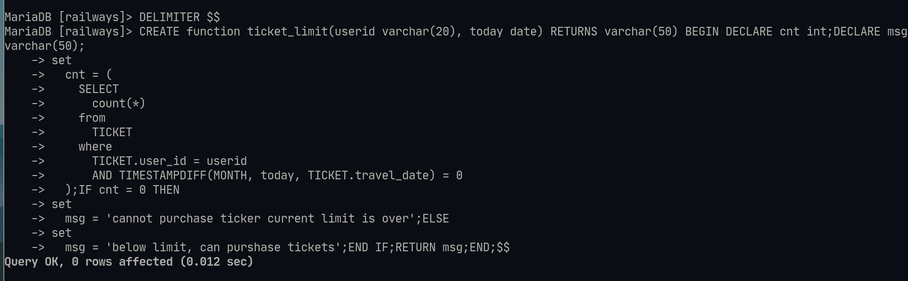
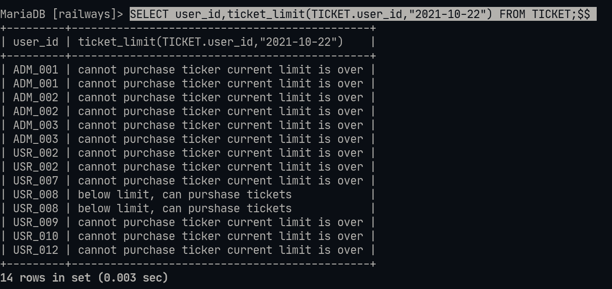
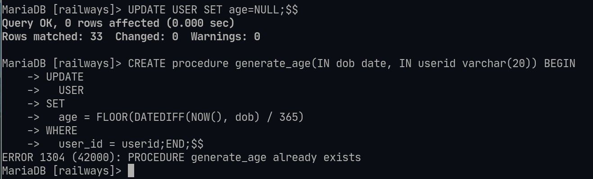
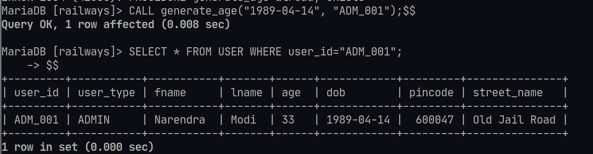

# Lab-8 Functions and stored proceudres :

## Details : 
- SRN : PES2UG20CS237
- Name : P K Navin Shrinivas 
- Section : D

## Question 1 : 

Commands : 
```sql
DELIMITER $$

CREATE function ticket_limit(userid varchar(20), today date) RETURNS varchar(50) BEGIN DECLARE cnt int;DECLARE msg varchar(50);
set
  cnt = (
    SELECT
      count(*)
    from
      TICKET
    where
      TICKET.user_id = userid
      AND TIMESTAMPDIFF(MONTH, today, TICKET.travel_date) = 0
  );IF cnt = 0 THEN
set
  msg = 'cannot purchase ticker current limit is over';ELSE
set
  msg = 'below limit, can purshase tickets';END IF;RETURN msg;END;$$

SELECT user_id,ticket_limit(TICKET.user_id,"2021-10-22") FROM TICKET;$$
```

Screenshots : 



## Question 2 : 

Command : 
```sql
CREATE procedure generate_age(IN dob date, IN userid varchar(20)) BEGIN
UPDATE
  USER
SET
  age = FLOOR(DATEDIFF(NOW(), dob) / 365)
WHERE
  user_id = userid;END;$$

UPDATE USER SET age=NULL;$$
CALL generate_age("1989-04-14", "ADM_001");$$
SELECT * FROM USER WHERE user_id="ADM_001";$$
```

Screenshots : 


