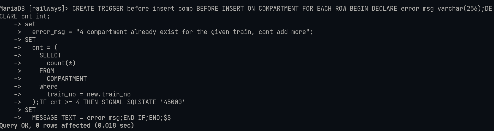
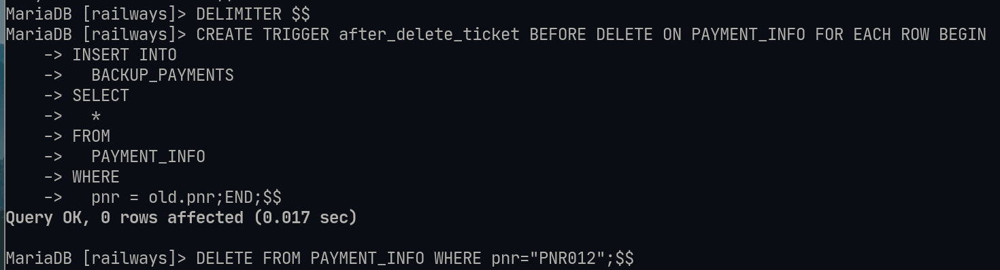

# Lab-9 Triggers:

## Details : 
- SRN : PES2UG20CS237
- Name : P K Navin Shrinivas 
- Section : D

## Question 1 : 

Commands : 
```sql
CREATE TRIGGER before_insert_comp BEFORE INSERT ON COMPARTMENT FOR EACH ROW BEGIN DECLARE error_msg varchar(256);DECLARE cnt int;
     set
       error_msg = "4 compartment already exist for the given train, cant add more";
     SET
       cnt = (
         SELECT
           count(*)
         FROM
           COMPARTMENT
         where
           train_no = new.train_no
       );IF cnt >= 4 THEN SIGNAL SQLSTATE '45000'
     SET
       MESSAGE_TEXT = error_msg;END IF;END;$$
insert into COMPARTMENT values ("I class", 16, 6, 62621, "A12");
```

Screenshots : 



## Question 2 : 

Command : 
```sql
CREATE TRIGGER after_delete_ticket BEFORE DELETE ON PAYMENT_INFO FOR EACH ROW BEGIN
INSERT INTO
  BACKUP_PAYMENTS
SELECT
  *
FROM
  PAYMENT_INFO
WHERE
  pnr = old.pnr;END;$$
```

Screenshots : 

