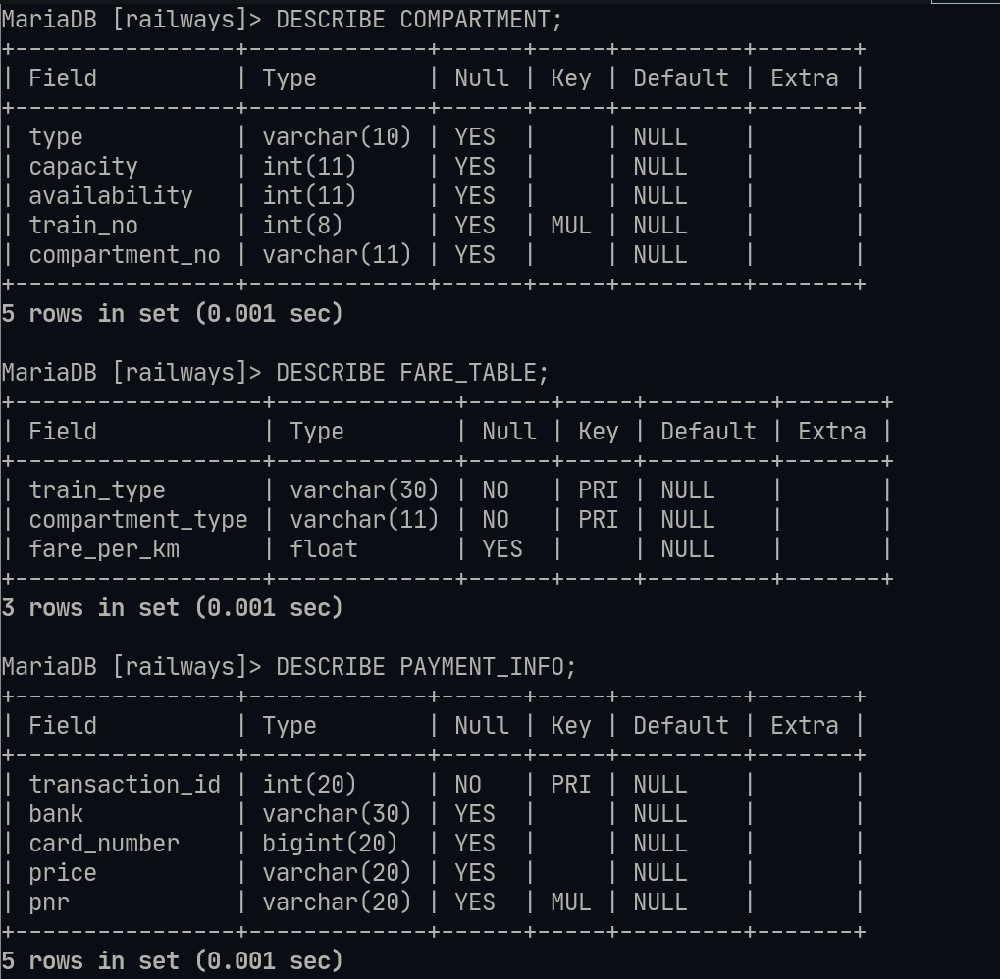
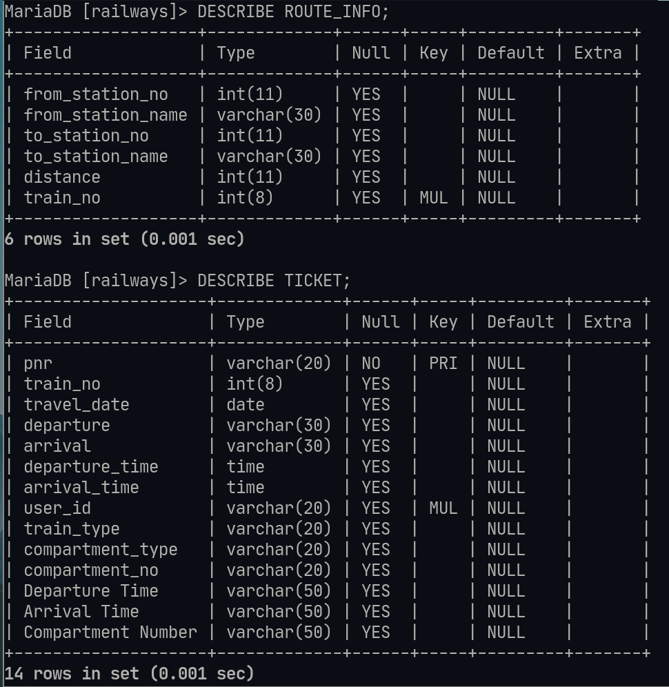
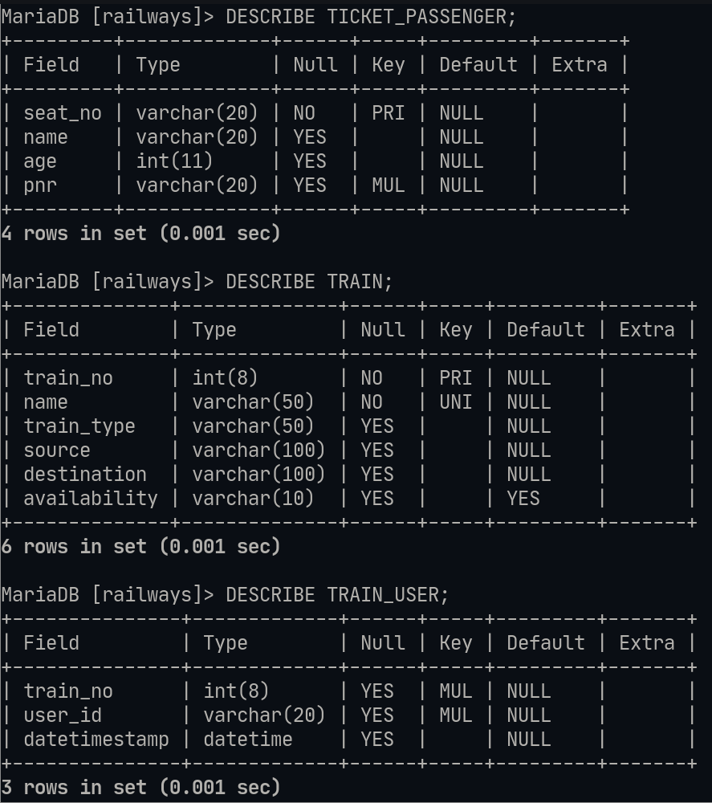
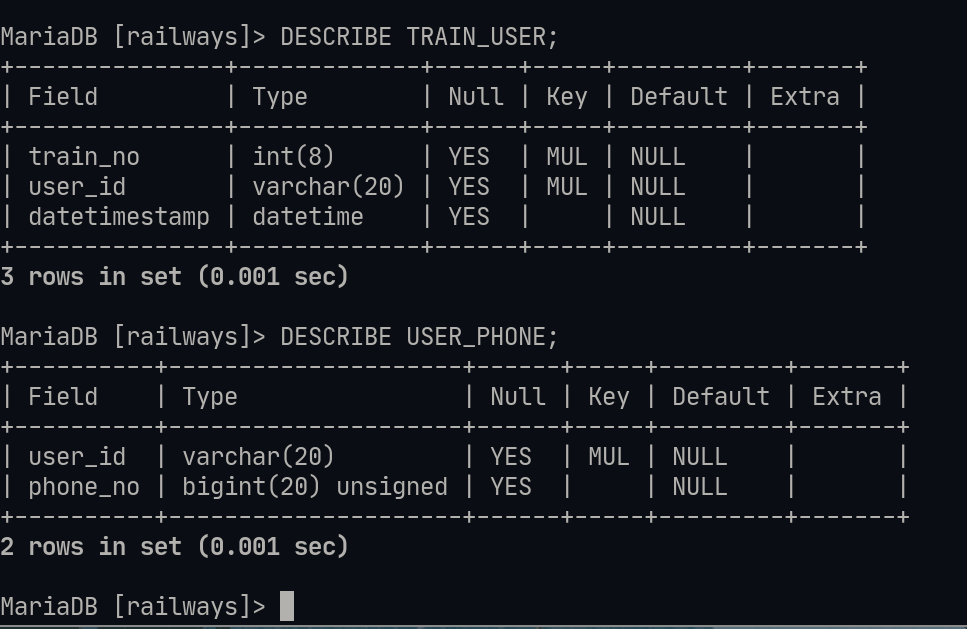

# DDL - Data definition language 

## Info : 
- Name : P K Navin Shrinivas 
- SRN : PES2UG20CS237 
- Section : D 

## Screenshots : 
- Down below are all the screenshots describing all tables : 

