# DML - Data Manipulation Langauge

## Info : 
- Name : P K Navin Shrinivas 
- SRN : PES2UG20CS237 
- Section : D 

### Question 1 : 

### Question 2 : 
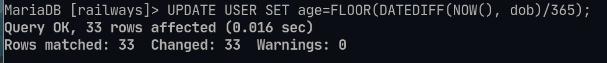
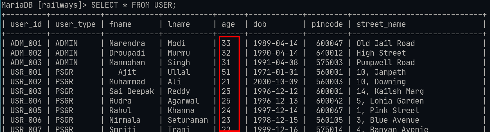

### Question 3 : 
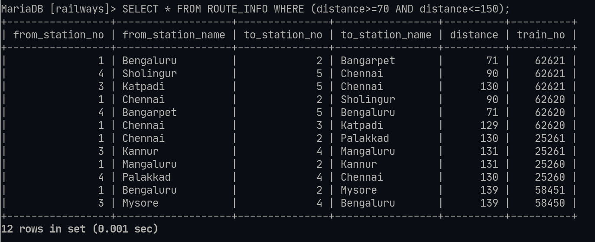

### Question 4 : 
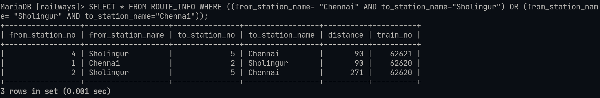

### Question 5 : 
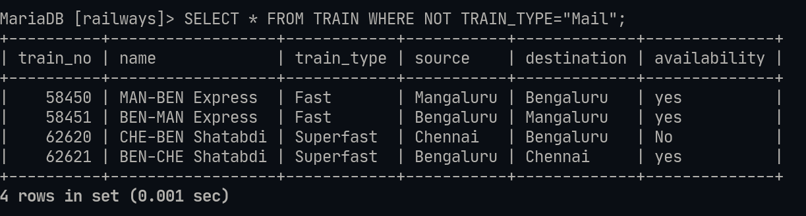

### Question 6 : 
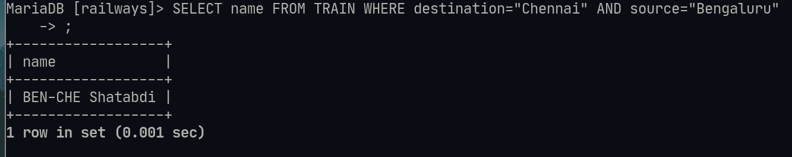

### Question 7 : 
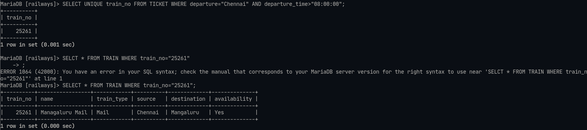

### Question 8 : 
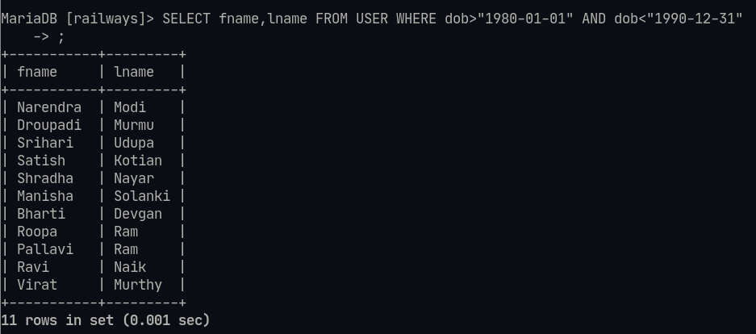

### Question 9 : 
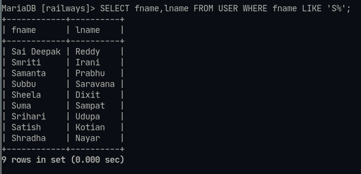

### Question10 : 
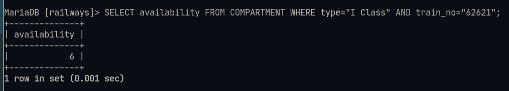

### Question 11 : 
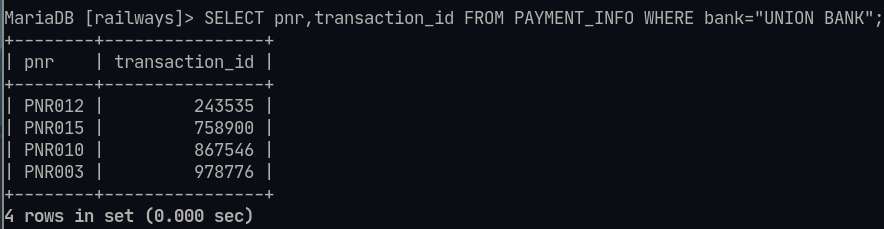

### Question 12 : 
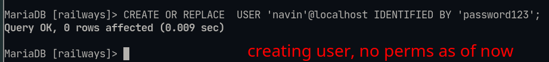
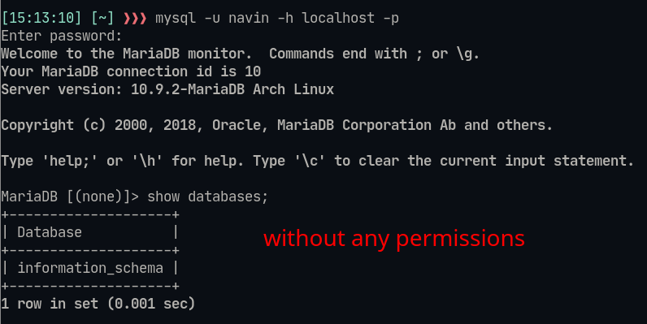
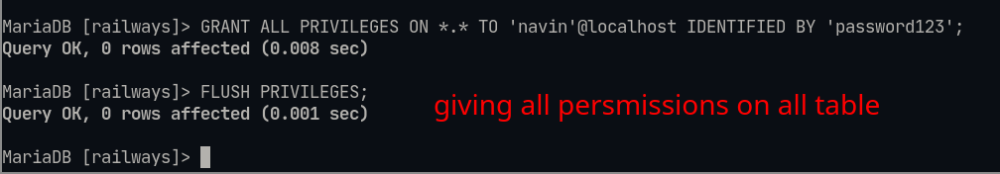
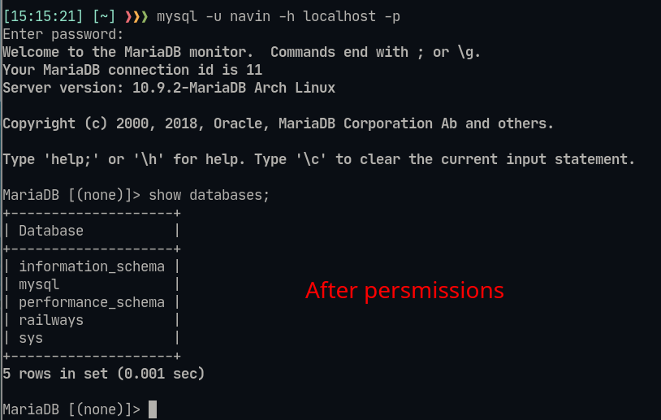

### Question 13 : 
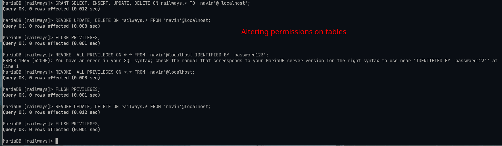
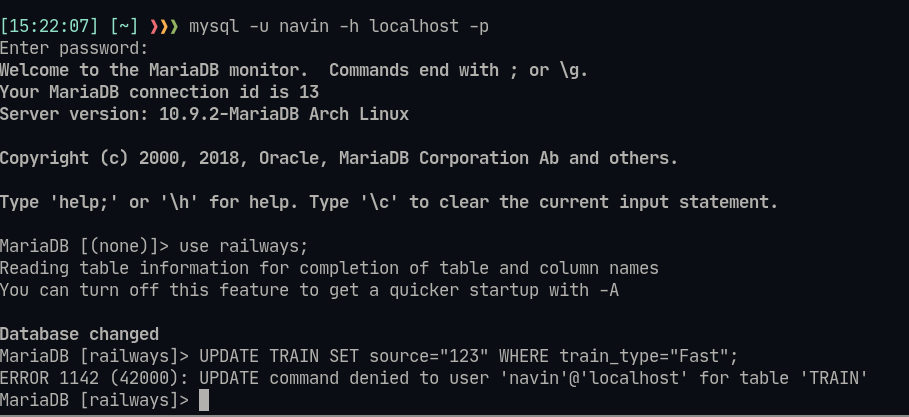

