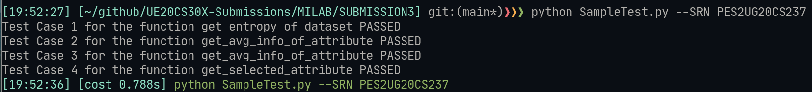

# Assignment Submission-3 | ID3 Algorithm

## Details : 
- SRN : PES2UG20CS237
- Name : P K Navin Shrinivas
- Section : D 

> Note : Python file has been attached in the same submission as this PDF

### Code : 
```py
'''
Submission by : 
SRN : PES2UG20CS237
NAME : PK Navin Shrinivas
'''


'''
Assume df is a pandas dataframe object of the dataset given
'''

import numpy as np
import pandas as pd
import random
import math


'''Calculate the entropy of the enitre dataset'''
# input:pandas_dataframe
# output:int/float
def get_entropy_of_dataset(df):
    # TODO
    label = df.iloc[:,-1]
    p = 0
    n = 0
    for i in label:
        if i=="yes":
            p += 1
        else:
            n += 1
    if p == 0 or n == 0: # Corner case
        return 0
    p_positive = p/(p+n)
    p_negative = n/(p+n)
    entropy_of_sample = -(p_positive*math.log(p_positive, 2))-(p_negative*math.log(p_negative, 2))
    entropy = entropy_of_sample
    return entropy


'''Return avg_info of the attribute provided as parameter'''
# input:pandas_dataframe,str   {i.e the column name ,ex: Temperature in the Play tennis dataset}
# output:int/float
def get_avg_info_of_attribute(df, attribute):
    # TODO
    attr_vec = list(df[attribute])
    label = df.iloc[:,-1]
    domain = []
    # entropy_of_attr_domains = [] # Debug

    for i in attr_vec:
        if i not in domain:
            domain.append(i)

    ## Domain and looping on domain is solely a space optimisation and coding easiness
    ## This inactuality dunks time performance
    avg_info_temp = 0

    for i in domain:
        temp_vec = []
        for j in range(0, len(attr_vec)):
            if attr_vec[j] == i:
                temp_vec.append(label[j])
        temp = get_entropy_of_dataset(pd.DataFrame(temp_vec, columns = ["label"]))
        # entropy_of_attr_domains.append(temp) #Debug
        avg_info_temp+=((len(temp_vec)/len(attr_vec))*temp)
        # Reusing above function, reuse go stonksss!

    # print(entropy_of_attr_domains) #Debug
    avg_info = avg_info_temp
    return avg_info


'''Return Information Gain of the attribute provided as parameter'''
# input:pandas_dataframe,str
# output:int/float
def get_information_gain(df, attribute):
    # TODO
    information_gain = get_entropy_of_dataset(df) - get_avg_info_of_attribute(df, attribute)
    return information_gain


#input: pandas_dataframe
#output: ({dict},'str')
def get_selected_attribute(df):
    '''
    Return a tuple with the first element as a dictionary which has IG of all columns 
    and the second element as a string with the name of the column selected

    example : ({'A':0.123,'B':0.768,'C':1.23} , 'C')
    '''
    # TODO
    max_gain = ""
    map_struct = {}
    for i in list(df.columns)[:-1]: ## Excluding label
        i_a = get_information_gain(df, i)
        map_struct[i] = i_a
        if max_gain != "" and i_a > map_struct[max_gain] :  ## Short hand eval is helping here
            max_gain = i
        elif max_gain == "": # To cover a crash
            max_gain = i
    return (map_struct, max_gain)
```

### Screenshots : 

